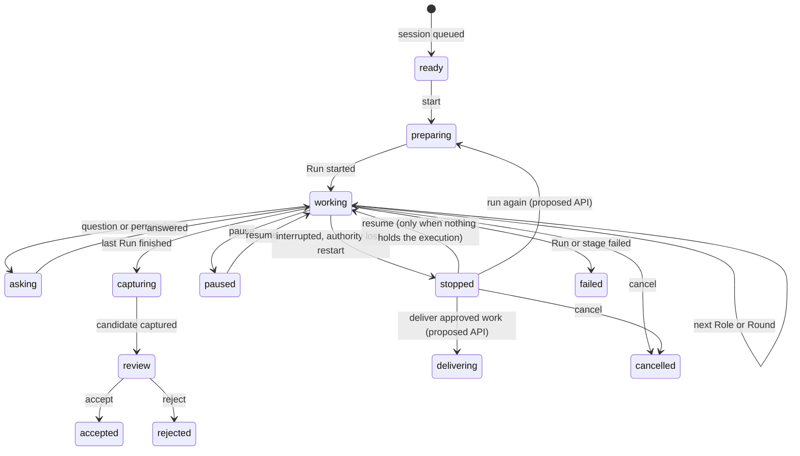

# What a Work Item is doing: progress in VS Code and the Agents window

Design record, 2026-10-10. It answers the owner's request "I don't see the progress of anything in the view inside the VS Code extension; make a detailed analysis of what should be shown here and what would be dev-ex friendly, then make it." It covers four surfaces: the extension's Work Item view, the extension's Now tree and status bar, a session in the VS Code Agents window, and the browser Work Item page for parity. The [glossary](../../../../docs/reference/glossary.md) terms apply: a Run is one Role executing against a Work Item, a Shift is the Team's whole attempt, a Round is a set of Runs that start together.

The design is built in [`public/core/progress.js`](../../public/core/progress.js), one statechart that every surface reads. The sections below say what each surface shows and does; [Validation status](#validation-status) says what was exercised.

## Why it exists

On 2026-10-10 the owner ran session `059675b9` (Ploeg Work Item 184, "Change the readme.md to be like a clown wrote it", team `unfold`, budget US$ 0,25). The implementer finished, the reviewer approved, and then the execution stopped. Every surface told a different story, and none said what to do inside VS Code.

## Evidence ledger

| # | Evidence | Source | What it shows |
| --- | --- | --- | --- |
| E1 | Implementer Run 14:39:01–14:39:42Z, README rewritten +57 −45, `git diff --check` passed | Session `059675b9` read through the API, 2026-10-10 | A finished writer Run with a change |
| E2 | Reviewer Run started 14:39:42Z; its transcript ends `VERDICT: approve` and JSON, but the session records it `running` | Same | A reader Run cut off after it answered; the verdict exists only in the transcript |
| E3 | Execution `interrupted`, `stopConfirmed`; blocker "Ploeg retains this stopped or interrupted execution for reconciliation. It will not retry automatically."; cost pending, 0 recorded, 0.026 observed; no candidate, no pull request | Same | The stop reason exists, the money is observed but unsettled, nothing reviewable was captured |
| E4 | Work Item view: "Needs you" + "Stopped; open for details"; card "Ploeg stopped this Work Item without a reason Unfold recognises…"; only **Open in browser**; tiles Cost US$ 0,03 "1 Run running", Runs 1 "1 running · none failed", Rounds 1 "1 Shift"; Cost per role `operator writer` 1 Run, tokens Not reported; Runs "0 Rounds · opened 1 h ago · Still open", `operator writer Running 1 h 34 min` | Owner screenshot | Contradictions: stopped and running at once; Ploeg's single `operator` Run stands in for the Unfold crew; 0 and 1 Rounds; no timeline, verdict, diff or branch; no next step inside VS Code |
| E5 | Agents window: the reviewer's reasoning and verdict as chat, then the blocker; the owner typed a new objective into the same session; it was accepted silently and nothing happened | Owner screenshot | The projection has no end-of-turn outcome and no answer to a message into a session that will not run again |
| E6 | Composer "Chat with Unfold crews [Unfold]", model "DeepSeek V4.1 Flash (Fireworks)"; new sessions via New → Workspace ▾ → "Unfold · <repo>" | Owner screenshot | The Agents window is a real entry point the owner uses |
| E7 | VS Code 1.141 renders `systemNotification`, `markdown`, tool calls and input requests in a turn; reads `_meta["vscode.chatInputState"]` to block input with a banner | [1.141 fit](../research/2026-10-08-vscode-1-141-fit.md#what-vs-code-reads-from-any-host), [AHP sign-in spike](../research/2026-10-10-ahp-sign-in-spike.md) | What a host can show; the input block is read from source and not yet seen live |
| E8 | The Work Item panel polls Ploeg every 6–15 s and never reads the Unfold session; the session panel streams `/api/sessions/{id}/events` | [`task-panel.ts`](../../extensions/vscode/src/task-panel.ts), [`panel.ts`](../../extensions/vscode/src/panel.ts) | Live data exists; the Work Item view does not use it |
| E9 | `GET /api/sessions` returns each session's `execution.workItemId` | [`store.ts` `publicSession`](../../src/store.ts) | A Work Item can find its session without a new API |
| E10 | `GET /api/sessions/{id}/investigation` classifies a stop and reads a verdict from the transcript | [`investigation.ts`](../../src/investigation.ts), commit `959965e9` | A read-only diagnosis exists to link to |

No usage analytics, interviews or support tickets were available. Everything about frequency below is a proxy from these sources.

## Job stories

| Job story | Source |
| --- | --- |
| When I glance at VS Code while a Work Item runs, I want to see which Role is working, for how long and what it last did, so I can keep coding without opening the browser | E4, E8; the request |
| When a Work Item stops, I want one sentence that says what was achieved, why it stopped and what I can do, so I do not have to read its history | E1–E4 |
| When the reviewer approved but nothing was delivered, I want to deliver the approved work or run it again from VS Code, with a confirmation that says what it costs and changes | E2, E3; the concurrent recovery work |
| When a change is ready, I want to see it in VS Code's diff editor, so I review it where I write code | E1; the request |
| When I type into a session in the Agents window, I want to know at once whether a crew will read it | E5 |

Proxy top tasks, most frequent first: glance at progress; read why it stopped; open the change; act on the stop (deliver, run again, investigate); answer a question.

## Task model

| Task | Frequency | Cost of error | Consequence |
| --- | --- | --- | --- |
| Glance at progress | Many times a day | Low | Status bar and Now rows carry Role, elapsed time and spend; no click needed |
| Read why it stopped | A few times a day | Medium: a wrong reading leads to a wrong retry | One headline from the statechart; the reason in words; contradictions stated, not shown as facts |
| Open the change | Daily | Low | **View change** opens VS Code's diff editor; no confirmation |
| Deliver approved work | Occasionally | High: pushes a branch and opens a pull request | Specific modal confirmation naming the branch, repository and that nothing merges |
| Run again | Occasionally | High: spends budget | Specific modal confirmation naming the Team, the budget and that the earlier Runs stay |
| Cancel | Rarely | High: irreversible | The existing modal confirmation |
| Answer a question | When asked | Medium | Primary action while the crew waits |

Assumptions, unproven: developers keep VS Code open while work runs (E6 suggests yes); a reviewer verdict read from a transcript is worth showing when it is labelled as unrecorded (E2); the recovery actions land as an API the extension can call (see [Interface](#the-recovery-interface)).

## One statechart

Every surface reads one derived state, built from the session, its execution binding, its Runs, its candidate and, when a Work Item has one, Ploeg's detail and Run card. The phases are exclusive; a contradiction between sources is resolved here and stated as a fact, so no surface can say "1 Run running" on a stopped Work Item.

Rules that resolve the sources:

1. **A Run is running only while its session is.** A Run whose record says `running`, `waiting_input` or `paused` in a session that is not active reads **Cut off** at the session's stop time.
2. **A verdict in the transcript is shown, and labelled.** When a cut-off reader's own text ends with `VERDICT: approve` (or the JSON `"verdict"`), the step reads "approved in its transcript, not recorded". It is never presented as a recorded verdict.
3. **Ploeg's `operator` Run is the container, not a Role.** For a Work Item that a session drives, the steps are the session's Roles. Ploeg's Run is listed as "Ploeg's record", and when Ploeg still lists it as running after the session stopped, a fact says so.
4. **Money is one figure with its status.** Settled spend, else the gateway's observed spend marked "observed, not settled", else "Not reported". Never zero for unknown, never "running" for a stopped session.
5. **The stop reason comes from the session's last stop event**, not from Ploeg's generic state: authority lost, Ploeg holds it for reconciliation, Unfold restarted, stopped by a person, failed at a stage.

### State matrix

Headline is what the status bar tooltip, the Now row, the Work Item view and the Agents window activity line derive from. Actions are listed primary first.

| Phase | Condition | Headline (example) | Primary | Secondary |
| --- | --- | --- | --- | --- |
| ready | `queued` | Ready to start · nothing has run | Start | Open session |
| preparing | `running`, no Run started | Preparing the workspace | Open session | Pause |
| working | `running`, a Run active | Implementer is working · Round 1 (the clock, 0:41, ticks in the live line and the status bar) | Open session | Pause |
| asking | `waiting_input` | Reviewer asks you: Allow `npm test`? | Answer | Open session |
| capturing | `exporting` | Capturing the change for review | Open session | — |
| paused | `paused` | Paused while implementer was working | Resume | Cancel |
| stopped, approved | `interrupted`, a reader approved (recorded or in transcript), no candidate | Reviewer approved · stopped before delivery | Deliver approved work¹, else Investigate | Run again¹, Investigate, View change², Open session, Cancel |
| stopped | `interrupted`, otherwise | Implementer finished · stopped: Ploeg holds it for reconciliation | Investigate | Run again¹, Deliver approved work¹, Resume³, View change², Open session, Cancel |
| failed | `failed` | Agent execution failed: <message> | Investigate | Run again¹, View change², Open session |
| review | `completed`, no review | Ready for your review · approved · 3 files +57 −45 | View change | Accept, Reject, Open pull request, Check out branch |
| changes requested | `completed` or `failed`, last reader requested changes | Reviewer requested changes | View change | Run again¹, Open session |
| accepted / rejected | review recorded | Accepted by Ryan | Open pull request (when one exists) | View change |
| cancelled | `cancelled` | Cancelled | Open session | — |

¹ Offered only when the server lists it ([interface](#the-recovery-interface)). ² Offered only when a diff artifact or a ready candidate exists. ³ Only when no Ploeg execution is retained for reconciliation.

Rows by surface and role: a viewer gets no mutating action anywhere; a demo session says "Demo · no model calls or spend" beside every figure; an offline extension keeps the last state with its age and offers nothing that mutates.

### Worst-case fixture

[`test/fixtures/session-059675b9.json`](../../test/fixtures/session-059675b9.json) models the evidence: the finished implementer, the reviewer whose record says running and whose transcript approves, the interrupted execution with `stopConfirmed`, the reconciliation blocker, observed but unsettled spend, no candidate, and Ploeg's Work Item 184 in `needs_human` with one `operator` Run still `running`. Unit tests, the extension's webview check and the browser check render it.

## What each surface shows and does

### Extension Work Item view

The view opens on a **Progress** card when a session drives the Work Item:

- the phase pill and the headline, then one sentence: why, and what happens next;
- a live line while a Run is active: Role, Round, elapsed time ticking each second, last activity and when, spend against budget;
- **Steps**: each Role in order with its outcome, verdict (recorded, or "in its transcript, not recorded"), duration and summary; a cut-off Run says so;
- **Change**: files, lines added and removed, the branch, the candidate's state and the pull request;
- **Facts**: each contradiction resolved by the rules above, in words;
- the actions from the matrix, as buttons. **View change** opens VS Code's multi-file diff editor with each file's before and after; a unified patch without file contents opens as a diff document. **Investigate** opens the read-only diagnosis as a Markdown document. **Open session** opens the session panel. **Deliver approved work** and **Run again** ask for a specific confirmation.

The facts row uses the same state: Cost reads "US$ 0,03 · observed, not settled", Runs reads "2 · implementer finished, reviewer cut off", and Ploeg's Run list moves under a disclosure, "As Ploeg records it". The view follows the session's event stream while visible and redraws within a second of an event; Ploeg's detail keeps its slower poll.

A Work Item without a session keeps its existing view, with one fix from rule 1: a Run counts as running only while the Work Item is `leased`.

### Extension Now tree and status bar

- **Now** lists sessions by the same phase: **Running** rows read "Implementer · Round 1 · 2 min · US$ 0,03"; **Needs you** holds asking, stopped and failed sessions; **Ready for your review** holds completed sessions. A Ploeg row for a Work Item that a session drives is replaced by the session's row, so the item appears once. A row opens the Work Item view when the session has a Work Item, else the session panel.
- **Status bar**: with one active session, "$(sync~spin) Reviewer 0:41", ticking each second; with more, the counts. The tooltip lists each session's headline. A click opens that one Work Item, or Now.

### Agents window session

AHP has no buttons in a turn, so the projection speaks in parts:

| Moment | Part |
| --- | --- |
| A Run starts | `systemNotification`: "Implementer started · writes the change · Round 1" or "Reviewer started · reads the change and gives a verdict" |
| While a Run works | Session and chat `activity`: "Implementer is working", "Waiting for your answer", "Capturing the change" |
| A Run finishes | Markdown: "**Implementer** finished · 3 files +57 −45", "**Reviewer** approved", with its summary |
| The session stops, fails, pauses, completes or is cancelled | One Markdown outcome part that ends the turn: the headline, the steps, spend against budget, why, and the next steps with a link to the session page and the Work Item |
| After it stops | `activity` keeps the short headline, such as "Stopped · reviewer approved" |
| A message arrives while a Run works | `systemNotification`: "Queued for the Reviewer's next step", and "Picked up by Reviewer at 14:02 UTC" when that Run starts |
| A message arrives and no crew will read it | The turn is accepted; Markdown says why, and an input request offers **Run again and start**, **Run again with this message**, **Deliver the approved work first** (when available) and **Cancel** |
| The session stopped by itself or failed | A host turn, "What next?", with the available next steps as an input request and links to the pull request and the session page |
| The session ended or Ploeg holds its stopped execution | No input block. A completed chat is `read-only`; any other chat takes a message, which becomes a choice when no crew will read it |

### Browser Work Item page

The callout that linked a session now reads the same statechart: the headline, the steps and the next step, with the link to the session. The browser does not load session events, so a cut-off reader there reads "Cut off" without the transcript verdict, and the headline falls back to the stop reason: "Implementer finished · stopped: Ploeg holds it for reconciliation". The rest of the browser page (Ploeg's Run card, Rounds and the Needs-you box) still reads Ploeg's own record; see [Open gaps](#open-gaps).

## The recovery interface

The backend landed it on 2026-10-10 (`d86a0cf4`, [contract](../contracts/api.md#recovering-a-stopped-session)). The extension reads `GET /api/sessions/{id}/recovery` for a paused, interrupted or failed session (not for a viewer, who gets 403) and passes it to the statechart:

- `deliver` and `run_again` appear only when the answer lists them as available; `resume` follows the answer when it is listed, so an execution whose key Ploeg blocked is never offered Resume;
- the answer's `summary` becomes the sentence under the headline, after the cause;
- **Deliver approved work** calls `POST /api/sessions/{id}/deliver` after a confirmation that says Ploeg opens a pull request with the approved change and, when the verdict came from a transcript, says so first;
- **Run again** calls `POST /api/sessions/{id}/run-again` without a confirmation, because it only queues a new session that does not start; the extension then offers **Open new session**.

A Run the server halted keeps its transcript verdict with `verdictSource: 'transcript'`; the statechart shows it as "approved in its transcript", not as a finished Run's verdict.

Ploeg's own detail goes through `reconcileDetail` on both the extension and the browser page: a Run Ploeg still lists as running reads **Stopped** once its Work Item is not leased or the driving session stopped, and a Shift's Round is never lower than its Runs' Rounds, so "0 Rounds" no longer sits beside a Round 1 column.

## Copy and locale

Money uses the shared formatter in every surface (`US$ 0,03` in the default `nl-NL` locale), including the status bar and the Agents window. Token counts the gateway did not report read "Not reported". Role names are shown as the crew defines them; the words Run, Shift, Round, Role and Work Item follow the glossary.

## Independent review

Three fresh reviewers saw only the rendered screenshots, the state labels and the job story. Each finding was checked against the build before acting.

| Finding (reviewers) | Outcome |
| --- | --- |
| The headline said "Reviewer approved" while the page said the verdict was not recorded (all three) | Fixed: "Reviewer approved in its transcript · stopped before delivery"; Deliver's confirmation opens with "The reviewer approved only in its own transcript; the verdict was not recorded" |
| The reason it stopped was a mechanism, not a cause (two) | Fixed: the sentence leads with the cause from the stop events, "Unfold lost Ploeg's authority to run it at 16:40, after Ploeg did not answer in time", then the hold |
| No way to deliver approved work without the recovery API; one reviewer asked for a disabled button (P0 in one pass) | Partly: a disabled button for an API that does not exist would promise what the server cannot do, so the sentence says "This workbench does not offer delivery of approved work yet". The action appears when the server lists it |
| Cancel looked like the navigation links and wrapped under the primary action (all three) | Fixed: **Cancel session…** is last, set apart and in the danger colour; it keeps its modal confirmation |
| A reader Role "writing" (two) | Fixed: "writing its review" |
| A live dot on the cost tile read as healthy money (one) | Fixed: the dot is gone from the cost figure |
| The browser page still shows Ploeg's `operator` Run as Running, Round 0 against Round 1, "Stopped; open for details" (all three) | Open: see [Open gaps](#open-gaps). Only the shared session callout is in this change |
| Work Item 184 in VS Code and #109 in the browser; a demo banner over real spend (two) | Not a defect: the browser check serves the fixture as the demo's Work Item 109 so its other reads answer |
| "updated 1 h ago" beside **Live** (two) | Not a defect of the view: the fixture's Ploeg record is an hour old; the line is Ploeg's update time. Kept |
| Jargon such as "reconciliation", "candidate", "observed, not settled" (two) | Kept: these are the glossary's terms and the honest qualifiers; the plain sentence carries the meaning |
| "Stopped" twice above the fold (one) | Kept: the header names the state when the card is scrolled away |

## Open gaps

| Gap | Why it is open |
| --- | --- |
| The browser page outside the session callout | The Run card and the Needs-you box still read Ploeg's own record (for 184, "Stopped; open for details" until Ploeg's next release records `operator_interrupted`); the Rounds and Runs now read Stopped |
| The session's Round | Unfold sessions do not record a Round; the extension takes it from Ploeg's latest Shift, which read 0 for 184 |
| Now rows have no transcript verdict | The session list carries no events, so a cut-off reviewer reads "Stopped · Ploeg holds it for reconciliation" there; the Work Item panel and the Agents window outcome read the transcript |
| The Agents window choices | The input block of rc.55 is gone: VS Code 1.141 renders a rejected turn as an empty one, and a block left the person no way forward. Choices use the single-select input request VS Code 1.141 renders as a question carousel, read from the bundle; no desktop VS Code has rendered one yet ([VIK-1922](https://vikunja.webgrip.dev/tasks/1922) covers the live pass) |
| Two browser flows fail on `development` itself | `feeds` (Insights tile count 10, expected 9) and `work` (two checklist notes) fail on a clean checkout of `origin/development`; every other flow, including the new `progress` flow, passes |
| Real users | Nothing here was tested with people; the three reviews below are simulated |

## Validation status

Exercised on 2026-10-10 against the worktree build:

- Unit tests for the statechart (`test/progress.test.mjs`, 11), the AHP projection with the worst-case fixture (`test/ahp-progress.test.ts`, 3), the extension's Now rows, status summary and session linking (`extensions/vscode/test/now.test.ts`, `task-view.test.ts`).
- The extension webview in Chromium under the panel's nonce-only CSP (`npm run test:webview`): the worst case, offered recovery, a working session whose clock ticks without a reload, a viewer without actions, keyboard activation of the primary action and the screen-reader announcement, at 1000 px and 420 px without horizontal overflow.
- The browser Work Item page with the fixture at 1440 px and 390 px (`scripts/browser/progress.mjs`), including keyboard focus on the session link.
- The product-ux source scan on the changed webview and core files: no failures or warnings, one note about English-only plurals, which the application uses throughout.
- Three independent heuristic passes on the screenshots (Nielsen, a cognitive walkthrough, hierarchy and honesty); results in [Independent review](#independent-review).

Not exercised: a VS Code Extension Host (the multi-file diff editor and the Investigate document are covered by type checks only), a desktop Agents window, a screen reader, forced colours, and real users.
