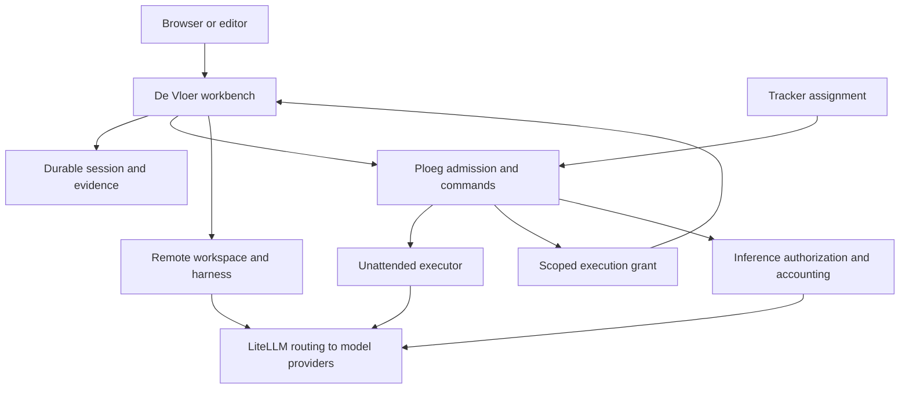

# Architecture

De Vloer is a human workbench for remote agent crews. A person chooses a registered repository, objective, reusable crew and spending limit; the server owns the session after the browser disconnects. People return to a consistent view of progress, changes, checks, blockers and decisions.

The design shifts repeated workspace setup and supervision out of individual terminals. The useful outcome is a reviewable change with evidence. More simultaneous agents alone is not the success criterion.

## Boundaries

| System | Authority |
| --- | --- |
| Tracker | Work content, priority and assignment |
| Ploeg | Unattended dispatch and opt-in operator admission, Shift/Run lifecycle, commands and inference authorization |
| De Vloer | Interactive sessions, delegated crew execution, human intervention, native workspaces and reviewable evidence |
| Agent harness | Native reasoning/tool loop and opaque conversation state |
| LiteLLM | Model routing, scoped virtual credentials and available spend records |
| Docker Engine | Container isolation of workspaces on the workbench host |
| Kubernetes | Pod isolation of workspaces in a team deployment |

The authenticated Ploeg read API supplies scoped work and evidence snapshots. With `execution.team` configured, an interactive session becomes one Ploeg Work Item, Shift and operator Run; De Vloer executes its crew under that authority. Human and background supervision preserve the same execution. [The execution contract](contracts/ploeg-execution.md) specifies this boundary, and [the operating guide](../../../docs/workflows/managed-execution.md) covers setup and recovery.

Standalone workbench sessions retain their existing broker behavior when shared execution is not enabled. Bound sessions cannot silently fall back to standalone authority. [Registered Vikunja and ClickUp imports](contracts/ploeg-tracker-binding.md) bind to the existing queued Ploeg Work Item and claim it atomically on Start. General WorkOrders and adoption of already executing harness work remain outside this boundary.

Session creation currently requires a registered repository and crew. An external ticket is optional. Repository-free conversation and automatic CI repair are product intentions, not general implemented workflows. [Unfold ADR-0002](../../../docs/adr/adr-0002-ploeg-is-the-only-engine.md) makes Ploeg the only execution engine: Vloer becomes its front end, and without Ploeg it runs only the deterministic demo. Until that migration lands, the standalone and shared execution paths described here remain the current implementation. See [product rule R8](../../../docs/domain/rules.md#r8).

## Implementation map

Every module in `src/`:

| Module | Role |
| --- | --- |
| [`src/main.ts`](../src/main.ts) | Startup and shutdown: wires the store, runtimes, broker, engine, agent host and HTTP server |
| [`src/config.ts`](../src/config.ts) | Parses and validates the configuration file and environment; defines the default crews and workspace placements |
| [`src/types.ts`](../src/types.ts) | Shared domain and adapter types: session, run, crew, configuration and the runtime interface |
| [`src/http.ts`](../src/http.ts) | The single router: REST API, server-sent events, static files, mutation guard and secret redaction |
| [`src/static.ts`](../src/static.ts) | Serves the public directory with a content ETag, 304 revalidation and cached gzip for text types |
| [`src/auth.ts`](../src/auth.ts) | Local password login, cookie sign-ins and the editor device-code sign-in |
| [`src/oidc.ts`](../src/oidc.ts) | OpenID Connect sign-in with PKCE; maps groups or a claim to a role |
| [`src/links.ts`](../src/links.ts) | Per-person linked GitLab and ClickUp accounts, stored encrypted, used for tracker reads and clone access |
| [`src/store.ts`](../src/store.ts) | SQLite store for sessions, events, permissions, users, sign-ins, encrypted internal state and the card collection (logins, binder marks, opened packs and pulls) |
| [`src/engine.ts`](../src/engine.ts) | Session lifecycle: create, start, pause, resume, cancel, retry, review, messages, permissions and budget; runs crew roles in sequence, captures the candidate and recovers after a restart |
| [`src/failures.ts`](../src/failures.ts) | Fixed catalogue of safe failure categories and stages, and classification of runtime errors into it |
| [`src/broker.ts`](../src/broker.ts) | Standalone LiteLLM admin client: mints, reads, revokes and reconciles per-session virtual keys |
| [`src/execution-authority.ts`](../src/execution-authority.ts) | Shared-mode client for Ploeg's operator execution API: admission, commands, credential, spend and block |
| [`src/ploeg.ts`](../src/ploeg.ts) | Read-only, validated Ploeg operator client for teams and Work Items |
| [`src/ploeg-demo.ts`](../src/ploeg-demo.ts) | Illustrative Ploeg records served in demo mode |
| [`src/collection.ts`](../src/collection.ts) | The person's card collection ([ADR 0029](adrs/0029-binders-packs-and-pulls-collect-run-cards-privately-and-fairly.md)): card logins, the binder, packs and their stored pulls, seen markers and the Team season page, always keyed by the signed-in person |
| [`src/packs.ts`](../src/packs.ts) | Card moments from facts, ISO-week and sprint periods, pack composition, copy roles, the published odds and the HMAC-SHA256 pull |
| [`src/season.ts`](../src/season.ts) | Calendar quarters and a Team's season totals, never per person |
| [`src/tasks.ts`](../src/tasks.ts) | Tracker connectors for Forgejo, GitHub, GitLab, ClickUp, Vikunja and a demo source; reads everywhere, and Vikunja assignee and comment writes for hand-off |
| [`src/task-handoff.ts`](../src/task-handoff.ts) | Hands a Vikunja task to a Ploeg team by assigning its tracker user, takes it back, and reports the Ploeg work for a task |
| [`src/rich-text.ts`](../src/rich-text.ts) | Adds `descriptionMarkdown` for display: Vikunja HTML becomes Markdown the browser and the editor's task view render; other text passes through |
| [`src/markdown.ts`](../src/markdown.ts) | Dependency-free, size-capped HTML-to-Markdown converter, in CommonMark or the subset the browser's renderer reads |
| [`src/task-binding.ts`](../src/task-binding.ts) | Looks up and compares the Ploeg Work Item bound to an imported Vikunja or ClickUp task |
| [`src/candidates.ts`](../src/candidates.ts) | Captures a workspace change as a Git bundle, binary patch and manifest |
| [`src/attestations.ts`](../src/attestations.ts) | Signs candidate provenance and Agent Trace records as Ed25519 DSSE envelopes |
| [`src/delivery.ts`](../src/delivery.ts) | Shared-mode candidate delivery: canonicalize, verify, record the receipt and approval in Ploeg |
| [`src/delivery-config.ts`](../src/delivery-config.ts) | Validates delivery policies and computes the policy hash |
| [`src/delivery-verifier.ts`](../src/delivery-verifier.ts) | Runs a policy's pinned checks in throwaway Docker containers |
| [`src/trusted-candidate.ts`](../src/trusted-candidate.ts) | Rebuilds a captured candidate as one canonical commit on the approved base, with hardened Git |
| [`src/ahp/host.ts`](../src/ahp/host.ts) | Agent Host Protocol server: connection tokens, JSON-RPC methods and session events projected as turns |
| [`src/ahp/websocket.ts`](../src/ahp/websocket.ts) | Minimal WebSocket upgrade, framing and connection-token generation |
| [`src/runtime/opencode.ts`](../src/runtime/opencode.ts) | OpenCode HTTP and event-stream adapter: native session, prompts, permission replies, transcript and verdict |
| [`src/runtime/command.ts`](../src/runtime/command.ts) | JSON-lines subprocess harness bridge, local backend only |
| [`src/runtime/demo.ts`](../src/runtime/demo.ts) | Deterministic fixture runtime for the demo; makes no model calls |
| [`src/runtime/workspace.ts`](../src/runtime/workspace.ts) | Chooses each session's workspace backend; clones locally and supervises `opencode serve` |
| [`src/runtime/docker.ts`](../src/runtime/docker.ts) | Docker Engine client and the hardened agent-container lifecycle |
| [`src/runtime/kubernetes.ts`](../src/runtime/kubernetes.ts) | Kubernetes API client: pod, volume, network policy and Secret manifests, and in-pod candidate export |
| [`src/runtime/sandbox.ts`](../src/runtime/sandbox.ts) | Alternative Kubernetes provisioner on agent-sandbox resources and warm-pool claims |
| [`src/runtime/relay.ts`](../src/runtime/relay.ts) | Dial-out relay under `/api/relay/` so sandbox workers poll the workbench instead of being called |
| [`src/runtime/git-access.ts`](../src/runtime/git-access.ts) | Git credential-helper environment for clones |

Outside `src/`:

| Path | Role |
| --- | --- |
| [`public/`](../public/) | Browser workbench: native modules, no build step. [Browser UI](browser-ui.md) is its contract: routes, view descriptors, core modules, CSS layers, tokens and accessibility rules |
| [`public/index.html`](../public/index.html) | The page: dialogs, toast and live region, and the classic [`core/theme.js`](../public/core/theme.js) that applies the stored theme before first paint |
| [`public/app.js`](../public/app.js) | Browser entry: boots, redirects old hashes, routes each hash to a view, moves focus to the page heading and dispatches delegated events to the handlers views register |
| [`public/shell.js`](../public/shell.js) | Grouped sidebar with counts, top bar with breadcrumbs, search, status strip and account menu, page heading, and on phones a navigation drawer and bottom bar, around every signed-in view |
| [`public/core/`](../public/core/) | Shared browser state, API client, DOM helpers and the view descriptor contract in [`registry.js`](../public/core/registry.js); hash routes and redirects ([`route.js`](../public/core/route.js)); one formatter for money, dates and durations ([`format.js`](../public/core/format.js)); the state vocabulary ([`states.js`](../public/core/states.js)) and why a Work Item needs a person ([`reasons.js`](../public/core/reasons.js)); per-browser preferences ([`prefs.js`](../public/core/prefs.js)); the live-update scheduler ([`live.js`](../public/core/live.js)), keyboard shortcuts ([`keys.js`](../public/core/keys.js)) and navigation counts ([`counts.js`](../public/core/counts.js)); the component string builders ([`ui.js`](../public/core/ui.js)), icons ([`icons.js`](../public/core/icons.js)), the brand lockup ([`brand.js`](../public/core/brand.js)) and the escape-first Markdown renderer ([`markdown.js`](../public/core/markdown.js)); the favicon dot and opt-in desktop notifications ([`favicon.js`](../public/core/favicon.js), [`attention.js`](../public/core/attention.js)) |
| [`public/views/`](../public/views/) | One module per screen area, each exporting a view descriptor, including the command palette ([`palette.js`](../public/views/palette.js)); [`index.js`](../public/views/index.js) lists them |
| [`public/cards/`](../public/cards/) | The proposed Run Card runtime ([ADR 0026](adrs/0026-run-cards-render-in-a-card-runtime-with-skin-packs-and-themes.md)): the `<unfold-card>` element ([`unfold-card.js`](../public/cards/unfold-card.js)), its DOM-free view model ([`card-model.js`](../public/cards/card-model.js)), the skin registry ([`registry.js`](../public/cards/registry.js)) and the skin packs in `skins/`: Vloer Native, and the forge skin that draws the card in 3D ([ADR 0028](adrs/0028-the-forge-skin-renders-run-cards-in-3d-with-vendored-three-js.md)); and the collection side ([ADR 0029](adrs/0029-binders-packs-and-pulls-collect-run-cards-privately-and-fairly.md)): the DOM-free [`collection-model.js`](../public/cards/collection-model.js), the shared thumbnail renderer [`thumbs.js`](../public/cards/thumbs.js), the pack ceremony [`pack-scene.js`](../public/cards/pack-scene.js) and its optional sound [`pack-sound.js`](../public/cards/pack-sound.js) |
| [`public/vendor/three/`](../public/vendor/three/) | three.js 0.165.0 (MIT), vendored unedited by [`scripts/vendor-three.mjs`](../scripts/vendor-three.mjs) for the forge skin and served from Vloer's own origin; only the forge skin, the binder's thumbnails and the pack ceremony load it |
| [`public/ploeg.js`](../public/ploeg.js), [`ploeg-activity.js`](../public/ploeg-activity.js), [`now.js`](../public/now.js), [`delivery.js`](../public/delivery.js) | Markup modules for the Work, feed, Now and delivery screens, kept DOM-free because Node tests import them |
| [`public/styles.css`](../public/styles.css), [`public/styles/`](../public/styles/) | The cascade-layer order, the Archivo `@font-face` rules and one stylesheet per layer: tokens, base, components, shell and one per view |
| [`extensions/vscode/`](../extensions/vscode/) | VS Code extension: Now, tasks, the Work Item panel, Ploeg work, sessions, linked accounts and agent-host setup |
| [`scripts/`](../scripts/) | Checks, smoke and browser checks, and the `qualify-*` scripts Ploeg's opt-in qualification runs |
| [`ops/`](../ops/) | Agent image, Helm chart, local Compose and cluster manifests |
| [`skills/`](../skills/), [`.agents/contracts/`](../.agents/contracts/) | Portable operator procedure and repository-specific facts |

Node 24 runs erasable TypeScript directly. The production application has zero third-party npm runtime dependencies; browser JavaScript uses native modules. There is no frontend build step or package installation in the demo path. This is a deliberate small-service choice, recorded in [ADR 0002](adrs/0002-native-node-and-single-writer-storage.md), rather than an inferred organization-wide frontend standard.

## Sessions, runs and handoffs

A session owns its objective, repository, branch, budget and human history. Crew roles execute sequentially. A crew may begin with one writer; every subsequent role is read-only, and at least one read role is required. The final read role reviews the work. Writing crews require its explicit approval to complete; earlier read roles supply analysis, and a wholly read-only crew does not use the same approval gate. See the [engine](../src/engine.ts). In shared mode these crew steps belong to one Ploeg operator Run; the two systems' run identifiers are not interchangeable.

Native harness session IDs are adapter details. They can support continuation within that harness, but are not portable conversation formats. The portable handoff consists of repository changes, an objective, remaining constraints, a summary, checks and review findings. Changing a model or harness does not migrate its hidden context.

Session events are persisted before they are exposed through the event stream. A browser can fetch history or reconnect with a numeric cursor. Sending a message records an instruction; applying it to an already executing model call requires an explicit supported intervention. Pause and cancel are deliberate lifecycle outcomes. Server recovery must not automatically repeat paid work.

## Trust and spending

Configuration supplies the allowed repository, crew, model and runtime IDs. User requests select from those registrations. Arbitrary process arguments and workspace endpoints are administrator configuration, not prompt-controlled inputs.

The standalone control plane holds its login secrets, LiteLLM minting credential, Docker socket and Kubernetes authority. In shared execution mode, the LiteLLM minting credential stays in Ploeg; De Vloer receives only the per-execution inference capability. A worker receives only its session's inference key, explicitly provisioned repository access and the environment names or Kubernetes Secrets an administrator listed for it. Placement is chosen per session from the backends a deployment enables ([ADR 0009](adrs/0009-workspace-placement-is-a-session-choice.md)). Without a `runtime.backend` setting the default is `local`; when `runtime.backends` lists several, the first listed is the default ([`src/config.ts`](../src/config.ts)). The `docker` backend runs the clone and the harness in a hardened container from the pinned agent image on the workbench host; choose it explicitly to keep workspaces away from the server's files. The `local` backend shares the control server’s OS user and permits access to server files through approved shell commands; use it only for trusted single-user development. Kubernetes is the intended isolated team backend for a workbench deployed in the cluster, with network policy enforcement dependent on the target cluster. Remote HTTP adapters are integrations with trusted, authenticated endpoints. A read-only role instruction is not a filesystem or credential boundary; review actual adapter and workspace enforcement before giving it production push access.

`budgetUsd` is authorized spend. `spentUsd` is the standalone accounting total, accompanied by `costStatus`. Shared executions expose provisional Ploeg readings through `observedUsd` and retain pending or unknown status until independent accounting is resolved. Demo work has no model calls. Pending or unavailable live metering must remain visible, and an administrator must explicitly authorize an increase. Gateway budgets, TTL and revocation reduce exposure; they are not proof of an exact monetary ceiling for in-flight requests.

## Operating envelope

SQLite is a **single writer, single application replica** store in this release. Durable storage does not provide distributed leases, high availability or cross-replica scheduling. Keep one server and one persistent volume. Scale remote workspace capacity independently; do not scale the server Deployment to obtain more control-plane throughput.

The local demo executes a real repository fixture and checks without AI calls. OpenCode, command runners, LiteLLM and Kubernetes have different prerequisites and validation levels. [Validation evidence](validation.md) is the source for what was actually exercised; [live operation](operations/live.md) describes deployment requirements. A rendered Helm chart or mock API test is not a live-cluster qualification.

## Decisions and next thresholds

The [ADRs](adrs/README.md) record chosen constraints and concrete reasons to revisit them. Before broad team rollout, validate one real repository end to end: authentication, remote workspace, one scoped paid run, human intervention, disconnect/reconnect, cost settlement, retained evidence and cleanup. Measure time to first reviewed result and human intervention time. Do not use agent count as a proxy for developer freedom.
