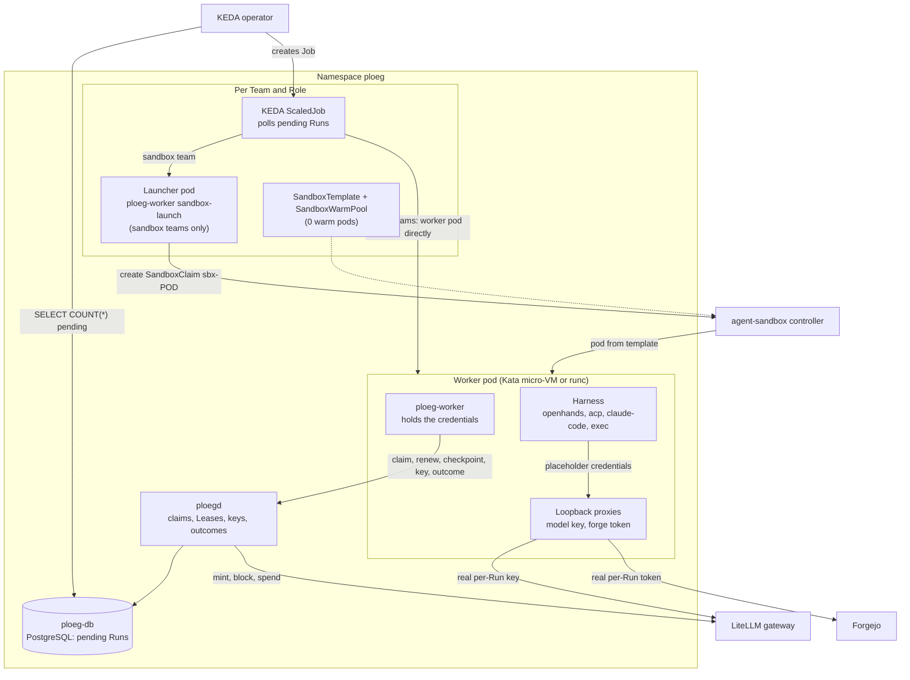
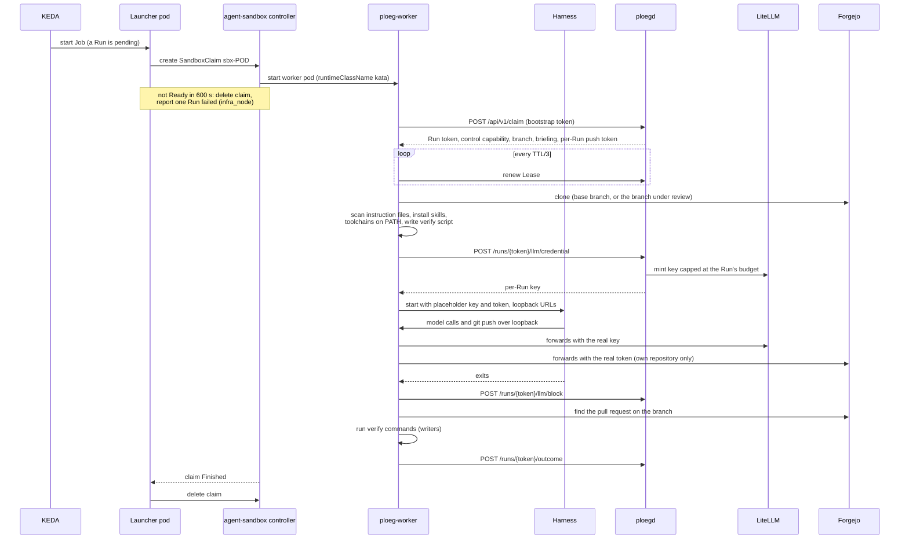

# Inside a Run

A **Run** is one **Role** executing against a **Work Item**: one builder writing code, or one reviewer reading it. [How work flows](how-work-flows.md) shows how Runs fit into a **Shift**. This page opens up a single Run: which pods start, where the credentials live, which program does the thinking and how the result gets back to Ploeg.

Three terms first:

* **Pod**: the smallest thing Kubernetes runs, one or more containers that start and stop together.
* **Harness**: the agent program that loops between the model and tools (edit a file, run a command). OpenHands is one; Ploeg drives it but does not contain it.
* **Kata Containers**: a container runtime that starts each pod inside its own small virtual machine (a micro-VM) with its own Linux kernel. A process that escapes the container is still inside that VM. The normal runtime, runc, shares the node's kernel.

## The parts

| Part | Source | What it does |
| --- | --- | --- |
| ScaledJob | [`scaledjob.yaml`](../../apps/ploeg/ops/helm/ploeg/templates/scaledjob.yaml) | One per Team and Role. KEDA runs `SELECT COUNT(*) FROM agent_runs WHERE team = … AND role = … AND state = 'pending'` against `ploeg-db` and starts one Job per pending Run. Production polls every 5 seconds. |
| Launcher | [`sandbox.go`](../../apps/ploeg/cmd/ploeg-worker/sandbox.go), [`sandboxlaunch`](../../apps/ploeg/pkg/sandboxlaunch/launcher.go) | For a Team with `executorType: sandbox`, the Job's pod runs `ploeg-worker sandbox-launch`. It creates one `SandboxClaim` named `sbx-<launcher pod name>` and waits for it to finish. It is the only pod with a Kubernetes API token, and its Role allows only `create`, `get` and `delete` on `sandboxclaims`. |
| SandboxTemplate | [`sandbox.yaml`](../../apps/ploeg/ops/helm/ploeg/templates/sandbox.yaml) | The worker pod template, with the Team's `runtimeClassName` (production: `kata`). A `SandboxWarmPool` with `replicas: 0` points at it, so every claim starts cold. |
| Worker | [`worker.go`](../../apps/ploeg/pkg/worker/worker.go) | Runs one Run and exits. Holds the Run's credentials and never hands them to the harness when isolation is on. |
| Harness | [`pkg/harness/adapters`](../../apps/ploeg/pkg/harness/adapters/) | The agent itself, started by the worker as a child process. |

A Team without `executorType: sandbox` skips the launcher: the ScaledJob's pod is the worker pod, under the node's default runtime (runc). The rest of this page is the same for both.

The [executor contract](../../apps/ploeg/docs/contracts/executor.md) calls the sandbox executor experimental. It depends on [kubernetes-sigs/agent-sandbox](https://github.com/kubernetes-sigs/agent-sandbox) v1.0.x, installed outside Unfold.

## One Run, start to finish

Step by step:

1. **Scale.** KEDA sees a pending Run for the Team and Role and creates a Job. The Job never retries (`backoffLimit: 0`): Ploeg owns retries.
2. **Launch (sandbox teams).** The launcher creates the claim. The claim is owned by the launcher's Job and carries a `shutdownTime` of the Run deadline plus a margin, so Kubernetes removes it even if the launcher dies.
3. **Start timeout.** If the claim is not `Ready` within `executor.sandbox.startTimeoutSeconds` (600 seconds by default), the launcher deletes it. It then claims one pending Run of its Team and Role with the worker bootstrap credential and reports it `failed` with reason `infra_node` ([`unstarted.go`](../../apps/ploeg/pkg/worker/unstarted.go)). KEDA cannot tell a launcher which Run it was started for, so the failed Run is whichever pending Run that claim returns. [Journeys](journeys.md#e-when-infrastructure-fails) follows what happens next.
4. **Claim.** The worker calls `POST /api/v1/claim` with its bootstrap token. A `204` means the queue is empty and the worker exits. Otherwise it gets a Run token, a signed control capability and, for a writer, a **Lease** on the Shift's branch. It renews the Lease every third of its TTL (production TTL: 15 minutes). A `404` on renew means the Lease is gone, and the worker stops the harness.
5. **Prepare.** The worker clones the repository. A reviewer fetches and checks out the branch under review and records the commit it reviewed. Only a reader that no writing Round precedes may review the base branch instead, and only when the forge says the branch does not exist yet. Any other reader that cannot fetch the branch ends its Run: `failed` (`infra_node`) when the forge cannot be reached, `stuck` when the branch is missing after a writer ([review.go](../../apps/ploeg/pkg/worker/review.go)). If the repository's agent instruction files contain hidden characters, the worker stops the Run instead of running the agent. It installs Ploeg's own skills under the Run's home directory, puts mounted toolchains on the harness's `PATH` and writes the verify commands as a script ([ADR-0035](../../apps/ploeg/docs/adrs/0035-runs-get-ploeg-owned-skills-mounted-toolchains-and-worker-verification.md)). Toolchains are container images the kubelet mounts read-only, so the Run needs no registry access.
6. **Key.** The worker asks ploegd for a model key. Only ploegd holds the LiteLLM master key. It mints a key for this Run, capped at the smaller of the Role's cap and what is left in the Shift's pool ([ADR-0008](../../apps/ploeg/docs/adrs/0008-litellm-is-the-credential-and-metering-seam.md), [ADR-0012](../../apps/ploeg/docs/adrs/0012-two-level-budgets-authorized-and-settled.md)).
7. **Work.** The worker starts the harness with the task prompt. A writer commits, pushes and opens or updates the pull request itself. A reviewer writes its verdict and findings to a drop-box file ([ADR-0018](../../apps/ploeg/docs/adrs/0018-the-outcome-drop-box-is-every-harnesss-return-path.md)). A writer writes the problem it addressed and its solution to the same file, and Vloer shows them under the Work Item's title ([ADR-0042](../../apps/ploeg/docs/adrs/0042-a-writing-run-reports-the-problem-and-solution-a-reviewer-reads.md)).
8. **Wrap up.** When the harness exits, the worker blocks the key on every exit path, looks up the pull request on the forge, and for a writer that opened or updated one, runs the verify commands itself without any credential. The result goes into the Run's findings, not its outcome. Before the harness starts, the worker records the commit a writer starts from and where the Run's branch stands on the forge. A writer that ends with no pull request counts as `no_change_needed` only when its checkout still matches that commit and the branch did not move. A writer that finds its pull request already open counts as `pr_updated` only when it pushed to the branch or left nothing behind in the checkout. Uncommitted changes (anything `git status` lists; the repository's `.gitignore` decides what is build output), local commits that never reached the forge, a branch pushed without a pull request, or a forge the worker could not read make the Run `stuck`, whether the agent changed files through an edit tool or a shell command ([unpublished.go](../../apps/ploeg/pkg/worker/unpublished.go)).
9. **Report.** The worker posts one outcome to `POST /api/v1/runs/{token}/outcome`: for example `pr_opened`, `pr_updated`, `no_change_needed`, `stuck` or `failed`. Later, ploegd settles the Run's real cost from LiteLLM's spend logs into the Shift's budget.

Whether a Run delivered is something the worker reads on the forge, never something the agent says ([ADR-0059](../../apps/ploeg/docs/adrs/0059-delivery-facts-come-from-the-forge-never-from-the-agents-outcome.md), proposed; the worker side is implemented). The drop box keeps the agent's own account (findings, verdict, problem, solution, proposed Work Items); a `pr_opened` or `pr_updated` outcome, links, a checkpoint, a failure reason, a verification or a delivery in it are dropped ([dropbox.go](../../apps/ploeg/pkg/harness/dropbox.go), [delivery.go](../../apps/ploeg/pkg/worker/delivery.go)). The worker reads the pull request for the Run's branch before and after the harness. It counts only a pull request from that branch in the Work Item's own repository (never a fork) against the target's base branch, and it reports what it saw as the outcome's `delivery`: the forge, repository, branch, pull request number and URL, the head commit before and after, and `opened`, `updated`, `none` or `unknown`. A read is tried three times. When the read before the harness fails, a writer does not start: it ends `failed` (`infra_node`) before a key is minted. When the read after it fails, the delivery is `unknown` and a writer ends `stuck`. ploegd does not yet check or store `delivery`; it still reads pull requests from the links the worker sends.
10. **Clean up.** The claim reports `Finished`; the launcher deletes it so the controller cannot restart a finished worker.

## Harness adapters

The Team (or Role) chooses the harness with `executor.harness.name` in the chart (`PLOEG_HARNESS` in the pod). [`adapters.go`](../../apps/ploeg/pkg/worker/adapters.go) builds one of four:

| Adapter | How it starts the agent | Notes |
| --- | --- | --- |
| `openhands` (default) | The agent-runner image's entrypoint, `docker-entrypoint.sh --headless -f <task file>` ([`openhands.go`](../../apps/ploeg/pkg/harness/adapters/openhands/openhands.go)) | Native, no protocol in between. A reviewer returns findings through the drop box. |
| `acp` | Any agent that speaks the Agent Client Protocol (ACP): JSON-RPC over the agent's standard input and output. Profiles: `opencode` (default), `qwen-code`, `goose`, `openhands` ([ACP profiles](../../apps/ploeg/docs/contracts/acp-profiles.md)) | No person is present, so the adapter answers every permission request at once from the mode the Team configures: `allow_always` (default), `allow_read_only` or `deny_all`. It stops a Run after 200 requests, or 60 in one minute. `qwen-code` and `goose` are not yet qualified. |
| `claude-code` | `claude -p` with a JSON result ([`claudecode.go`](../../apps/ploeg/pkg/harness/adapters/claudecode/claudecode.go)) | Permissions bypassed by default; the pod is the boundary. The target repository's hooks are disabled. |
| `exec` | Any program, with `{taskspec}` and `{taskfile}` substituted into its arguments ([`execbin.go`](../../apps/ploeg/pkg/harness/adapters/execbin/execbin.go)) | The escape hatch and the conformance target. The `copper` Team uses it to run `/bin/cat` and prove the plumbing without model calls. |

Whatever the adapter, the pull request on the forge is the ground truth for a writer: the worker checks the forge, not the harness's claim.

## Where the credentials live

The harness is the part most exposed to untrusted text: the Work Item, the repository's files and every tool output reach the model that drives it. [ADR-0034](../../apps/ploeg/docs/adrs/0034-the-harness-gets-placeholders-the-worker-keeps-credentials.md) (proposed) keeps credentials out of its reach:

* `ploeg-worker` marks itself non-dumpable at start, so a harness running as the same user cannot read its memory or environment ([`conceal_linux.go`](../../apps/ploeg/pkg/worker/conceal_linux.go)).
* With `PLOEG_LLM_KEY_ISOLATION=proxy`, the harness gets a random placeholder key and a loopback URL. A proxy in the worker swaps in the real key on the way to LiteLLM ([`llmproxy.go`](../../apps/ploeg/pkg/worker/llmproxy.go)).
* With `PLOEG_FORGE_TOKEN_ISOLATION=proxy`, a writer's git and forge API calls go through a second loopback proxy that adds the token and refuses anything outside the Run's own repository ([`forgeproxy.go`](../../apps/ploeg/pkg/worker/forgeproxy.go)).

Both proxies are off in the chart's defaults and on in production. Underneath them, every credential is scoped to the Run:

| Credential | Minted by | Scope | Ends |
| --- | --- | --- | --- |
| Model key | ploegd, through LiteLLM | This Run's budget and models | Blocked by the worker at the end, or by the sweep when the Run dies |
| Push token (writers) | ploegd, as Forgejo's bot user ([ADR-0013](../../apps/ploeg/docs/adrs/0013-push-rights-are-minted-per-run.md)) | `write:repository` on the Run's repository only | Revoked when the Run settles or its Lease lapses |
| Read token (reviewers) | Shared, from the chart's `readTokenSecret` | Read-only | Long-lived; a reviewer cannot push |
| Run token and control capability | ploegd, at claim | This Run's renew, checkpoint, key and outcome calls | With the Run |

The worker refuses to start if it can see the LiteLLM master key, the forge admin token or the database URL.

## Network reach

The `ploeg` namespace denies traffic by default. Per [ADR-0035](../../apps/ploeg/docs/adrs/0035-runs-get-ploeg-owned-skills-mounted-toolchains-and-worker-verification.md) and the [namespace policy](https://forgejo.webgrip.dev/webgrip/homelab-cluster/src/branch/main/kubernetes/apps/ploeg/ploeg/app/networkpolicy.yaml), a worker pod reaches:

* DNS;
* pods in `ploeg`: ploegd, and PostgreSQL (the network allows it; the worker holds no database credential);
* LiteLLM in `ai`, port 4000;
* Forgejo in `forgejo`, port 3000;
* the Vikunja API in `vikunja`, port 3456.

It has no route to the internet, the LAN or a container registry. A toolchain that downloads dependencies, such as `go test` fetching modules, fails inside the Run; that check is left to CI.

## What production runs today

Checked on 2026-09-29 against [homelab-cluster](https://forgejo.webgrip.dev/webgrip/homelab-cluster/src/branch/main/kubernetes/apps/ploeg/ploeg/app/helmrelease.yaml) `main` and the live `ploeg` namespace. Unfold `0.4.0-rc.11` is deployed.

| Team | Executor | Harness | Model | State on 2026-09-29 |
| --- | --- | --- | --- | --- |
| `copper` | Sandbox, `kata` | `exec` (`/bin/cat` on the task spec) | none called | Launchers completed on 2026-09-28 |
| `bronze` | Sandbox, `kata` (since 2026-09-29) | `openhands` for builder and reviewer | `deepseek-chat` | Moved to Kata that morning. Two builder launchers had failed and one claim was still starting when checked, so Kata is not yet proven for bronze |
| `silver` | KEDA, runc | `openhands` for builder and reviewer | `claude-sonnet-5` (builder), `deepseek-chat` (reviewer) | Paused and resumed the same morning. The builder was running when checked; KEDA still reported the reviewer ScaledJob as paused |

Across all Teams: model-key and forge-token isolation are both `proxy`, no worker runs a Docker-in-Docker sidecar, and a Go toolchain with a `gofmt` verify command is mounted in every Run.

Related: [How work flows](how-work-flows.md), [Journeys](journeys.md), [executor contract](../../apps/ploeg/docs/contracts/executor.md), [worker control contract](../../apps/ploeg/docs/contracts/worker-control.md).
