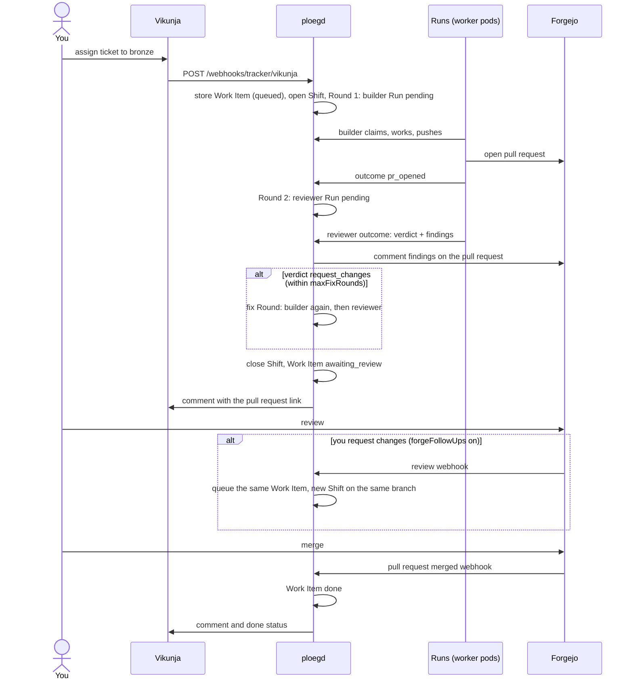
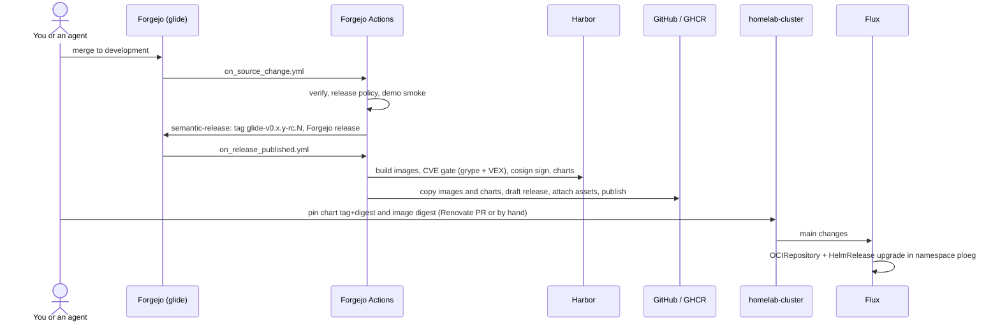
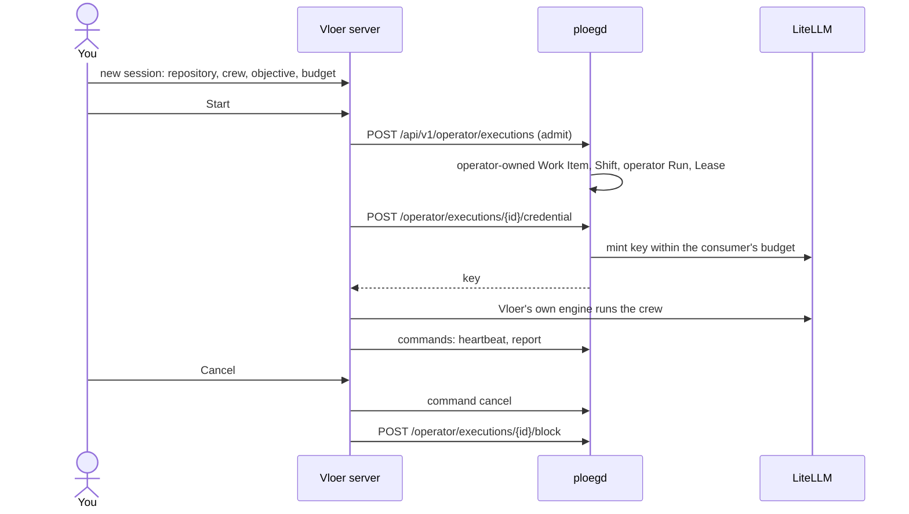
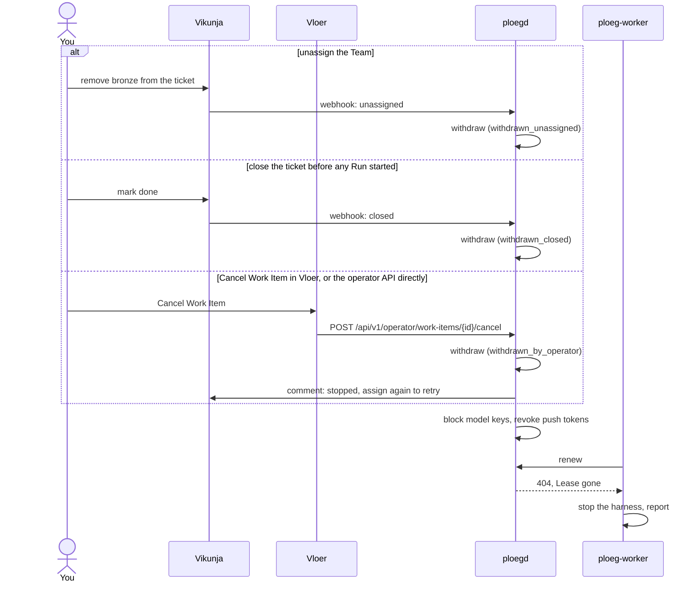
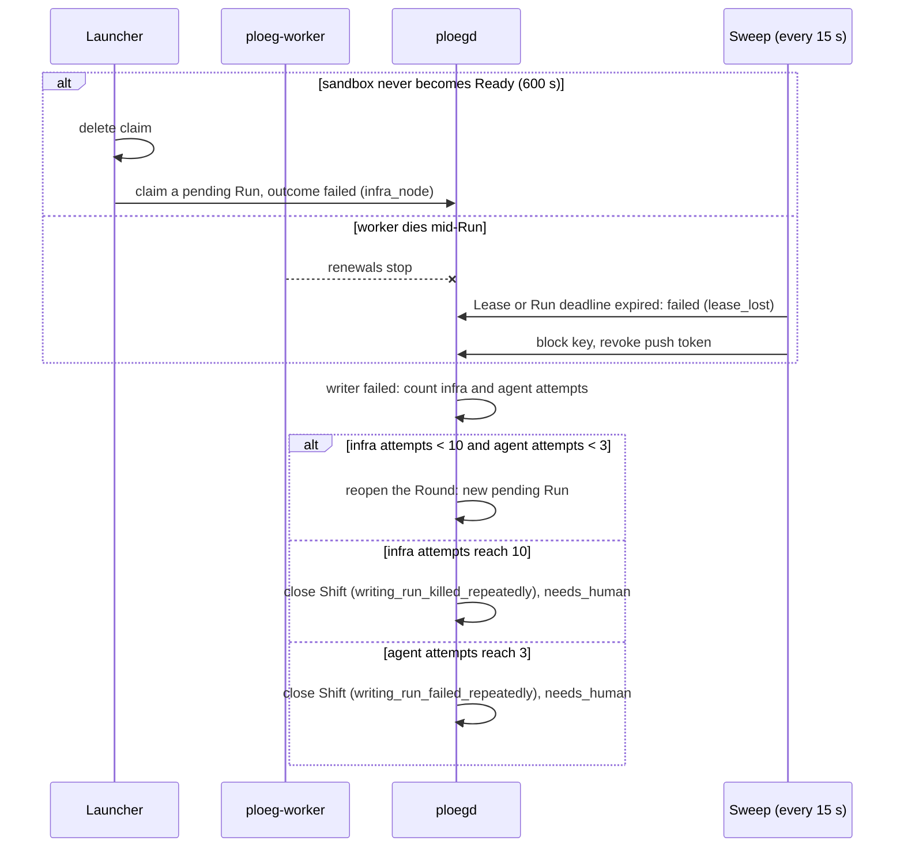

# Journeys

Five end-to-end paths through Glide, each from the point of view of the person who starts it. [Inside a Run](inside-a-run.md) zooms into the Run box that appears in several of them. The [glossary](../reference/glossary.md) defines Work Item, Shift, Round, Role, Run, Team and Lease.

| Journey | Starts with | Ends with |
| --- | --- | --- |
| [A. Ticket to merged pull request](#a-ticket-to-merged-pull-request) | You assign a Vikunja ticket to a Team | You merge the pull request |
| [B. Merge to production](#b-merge-to-production) | A commit lands on Glide's `development` | Flux runs the new release |
| [C. Starting work from Vloer](#c-starting-work-from-vloer) | You press Start in Vloer | The session completes or is cancelled |
| [D. Stopping work](#d-stopping-work) | You change your mind | Runs stop and credentials die |
| [E. When infrastructure fails](#e-when-infrastructure-fails) | A pod never starts or dies | A retry, or `needs_human` |

## A. Ticket to merged pull request

You assign a ticket on a routed Vikunja board to a Team user such as `bronze`. The Team's plan in production is a builder Round, then a reviewer Round, with fix Rounds when the reviewer asks for changes.

1. **Intake.** Vikunja calls `POST /webhooks/tracker/vikunja`. ploegd checks the signature, reads the ticket, picks the Team from the assignee and the repository from the board, and stores a queued Work Item. It opens the Shift at once ([`server.go`](../../apps/ploeg/pkg/httpapi/server.go), [`shiftengine/engine.go`](../../apps/ploeg/pkg/shiftengine/engine.go)). If that fails, the sweep, which runs every 15 seconds, repairs it.
2. **Builder Run.** KEDA starts a pod for the pending Run, which claims it, clones, runs the harness and pushes. The harness opens the pull request. The worker confirms it on the forge and reports `pr_opened` ([Inside a Run](inside-a-run.md)).
3. **Reviewer Run.** The next Round's reviewer checks out the branch with a read-only token and returns a verdict and findings. ploegd posts one comment per reviewer on the pull request ([`publish.go`](../../apps/ploeg/pkg/shiftengine/publish.go)). A `request_changes` verdict opens a fix Round, up to the Team's `maxFixRounds` (bronze 2, silver 1) and within the Shift's budget ([ADR-0017](../../apps/ploeg/docs/adrs/0017-the-review-loop-is-verdict-driven-and-capped.md)).
4. **Ready for you.** When the plan is done, ploegd closes the Shift. A Work Item whose writer opened or updated a pull request becomes `awaiting_review`; otherwise it becomes `needs_human`. ploegd comments on the ticket.
5. **Your review.** You review on Forgejo. If you request changes and the Team sets `forgeFollowUps.reworkOnChangesRequested` (bronze and silver do in production), ploegd stores the review, queues the same Work Item and opens a new Shift on the same branch. Your review text reaches the next builder as evidence ([`forge_followup.go`](../../apps/ploeg/pkg/httpapi/forge_followup.go)). A failed check can queue a repair Follow-Up the same way, but Forgejo does not deliver check events to Ploeg yet, so that path is configured and unproven.
6. **Merge.** Ploeg never merges. When Forgejo reports the merge, the Work Item moves to `done` and the ticket gets a comment and the done status. A pull request closed without merging moves it to `needs_human`. A reconcile loop also asks Forgejo every 10 minutes in case a webhook was missed ([`review.go`](../../apps/ploeg/pkg/shiftengine/review.go)).

[Assign work to an agent](../how-to/assign-work-to-an-agent.md) and [Review an agent pull request](../how-to/review-an-agent-pr.md) are the practical guides.

## B. Merge to production

A change to Glide itself becomes a signed release in CI. It reaches the cluster only when a commit in `webgrip/homelab-cluster` pins it. Glide never changes production itself.

1. **Validate.** A push to `development` runs [`on_source_change.yml`](../../.forgejo/workflows/on_source_change.yml): both applications' gates, the release policy and the demo smoke test.
2. **Version.** When `GLIDE_RELEASES_ENABLED` is `true`, semantic-release reads the commits under `apps/`, tags `glide-v0.x.y-rc.N` and creates the Forgejo release. `fix:` and `feat:` commits cut a release; `docs:` and `chore:` do not. Only zero-major release candidates are allowed ([ADR-0028](../../apps/ploeg/docs/adrs/0028-automatic-releases-stay-zero-major-candidates.md)).
3. **Build, gate, sign.** The published release triggers [`on_release_published.yml`](../../.forgejo/workflows/on_release_published.yml). Each image is built once in Harbor, held to its application's CVE budget with grype and OpenVEX statements, then signed and attested with cosign. Both Helm charts are published to Harbor.
4. **Distribute.** [`publish_release.py`](../../scripts/publish_release.py) copies the signed images and charts to Forgejo and GHCR, verifies digests, creates a draft GitHub release, attaches the assets and then publishes it without marking it latest. GitHub receives the source through a push mirror ([Source and artifacts](../operations/artifacts.md)).
5. **Pin.** Production state lives in `homelab-cluster`. The Ploeg chart is pinned by tag and digest in its [OCIRepository](https://forgejo.webgrip.dev/webgrip/homelab-cluster/src/branch/main/kubernetes/apps/ploeg/ploeg/app/ocirepository.yaml), and the `ploegd` image by digest in the HelmRelease. A Renovate rule groups one Glide release, both charts and three images, into one pull request, without automerge. The pins from `0.4.0-rc.2` to `0.4.0-rc.11` were committed by hand.
6. **Apply.** Flux reconciles the change and Helm upgrades the release. On 2026-09-29 the cluster ran `0.4.0-rc.11`.

[CI and releases](../operations/ci.md) covers the workflows and gates in detail.

## C. Starting work from Vloer

Vloer is the front end. [ADR-0002](../adr/adr-0002-ploeg-is-the-only-engine.md) decides that Ploeg executes every Run and that Vloer without Ploeg runs only its deterministic demo, which makes no model calls. That decision is accepted but not implemented yet. Today Vloer's shared execution works like this:

* **Admission.** Vloer asks Ploeg to admit an Operator Execution with its operator token ([`execution-authority.ts`](../../apps/vloer/src/execution-authority.ts)). Ploeg records a Work Item marked operator-owned, a Shift, an `operator` Run and a Lease, so its budget and audit cover the session. In production Vloer executes for the `vloer` Team, the `de-vloer` consumer's budget ceiling is US$0.25, and the `vloer`/`operator` key policy allows `deepseek-chat` for 10 minutes.
* **Execution.** The crew then runs inside Vloer, not in a Ploeg worker. Moving it to `ploeg-worker` is the [proposed front-end migration](../../apps/vloer/docs/ploeg-front-end.md).
* **No fallback.** A session Ploeg was asked to manage never runs standalone. If Ploeg is unreachable, Vloer interrupts it and tries to block the key ([`engine.ts`](../../apps/vloer/src/engine.ts)). Vloer's standalone broker still exists in the code until ADR-0002 lands.
* **Watching tracker work.** Vloer opens on **Now**, which lists what waits on you across your Teams. **Work**, **Proposed**, **Runs**, **Activity** and **Insights** read Teams, Work Items, Runs and events through the operator API ([`ploeg.ts`](../../apps/vloer/src/ploeg.ts)). On a Work Item's page, operators and administrators have **Cancel Work Item**. After a confirmation it calls journey D's operator cancel through Vloer's `POST /api/ploeg/work-items/{id}/cancel` and shows what Ploeg reports it stopped. The demo cancels nothing and says so ([HTTP contract](../../apps/vloer/docs/contracts/api.md#cancel)).

The [managed execution guide](../workflows/managed-execution.md) sets this up, and the [local demo](../workflows/local-demo.md) runs it without spending anything.

## D. Stopping work

There are three ways to take work back. All three go through one store function that closes the live Shift, cancels pending Runs, finishes running Runs, releases Leases and marks the Work Item `withdrawn`. ploegd then blocks the stopped Runs' model keys and revokes their push tokens ([`withdraw.go`](../../apps/ploeg/pkg/httpapi/withdraw.go), [`store/withdraw.go`](../../apps/ploeg/pkg/store/withdraw.go)).

| Way | When it acts | Close reason |
| --- | --- | --- |
| Unassign the Team on the ticket | Any time, if the removed assignee is the Work Item's Team | `withdrawn_unassigned` |
| Close the ticket | Only while the Work Item is queued and no Run has started or been authorized to spend. Otherwise the close is ignored and the work finishes | `withdrawn_closed` |
| Operator cancel, from Vloer's **Cancel Work Item** or `POST /api/v1/operator/work-items/{id}/cancel` | Any time, within the consumer's Teams. Posts a comment on the ticket | `withdrawn_by_operator` |

An operator-owned Work Item (journey C) ignores all three. Cancel its execution instead. Assigning the ticket again starts a new attempt.

## E. When infrastructure fails

A pod the cluster kills says nothing about the work, so Ploeg counts it apart from agent failures ([ADR-0021](../../apps/ploeg/docs/adrs/0021-infra-failures-and-agent-failures-get-separate-retry-budgets.md)). The reasons `infra_node`, `infra_llm` and `lease_lost` are infrastructure. `agent_error`, `budget` and an unset reason are the agent's.

* **Sandbox never starts.** The launcher gives up after `executor.sandbox.startTimeoutSeconds` and reports one Run of its Team and Role as `infra_node` ([`sandbox.go`](../../apps/ploeg/cmd/ploeg-worker/sandbox.go)). If that report fails, the sweep or the next launcher finds the Run.
* **Lease lost.** A worker that stops renewing loses its Lease. The sweep marks the Run `failed` with `lease_lost`, blocks its model key and revokes its push token, because a partitioned pod may still be alive ([`sweep.go`](../../apps/ploeg/cmd/ploegd/sweep.go)).
* **Retry.** For a failed writer, the Shift engine reopens the Round with a new pending Run until the infrastructure budget (10, `store.MaxInfraFailures`) or the agent budget (3, `store.MaxRunAttempts`) runs out. Then it closes the Shift and the Work Item becomes `needs_human`, with a message that says whether to look at the cluster or at the ticket ([`failedwriter.go`](../../apps/ploeg/pkg/shiftengine/failedwriter.go)). A failed reviewer does not stall the Shift; its findings are missing from that Round.

The `infra_node` path from the launcher was added in `0.4.0-rc.10`. On 2026-09-29 production had failed bronze launchers under Kata, but this page has not traced one through to a reopened Round. [Recover a stuck Lease or Run](../../apps/ploeg/docs/how-to/recover-a-stuck-lease-or-run.md) is the runbook.

Related: [How work flows](how-work-flows.md), [Inside a Run](inside-a-run.md), [Architecture](architecture.md).
