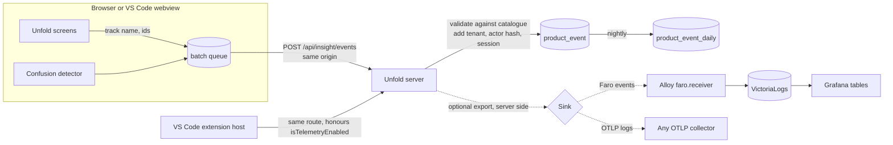
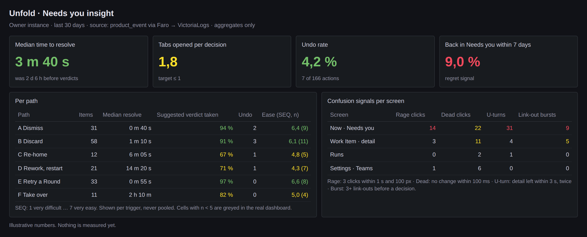
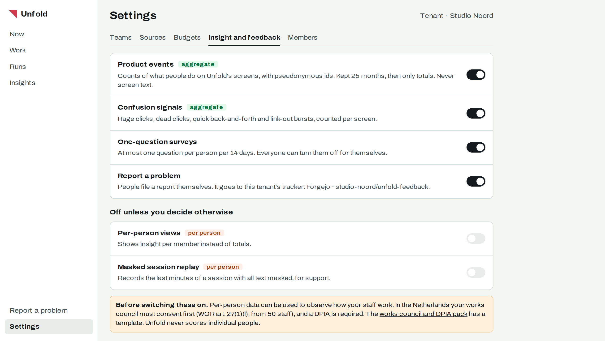

# RFC-0001: Product events and confusion signals

> Status: **Proposed** · Date: 2026-10-05 · Decision: [ADR-0023](../adr/adr-0023-unfold-measures-happiness-and-confusion-with-first-party-events-surveys-and-bug-reports.md) · Research: [product insight tooling](../research/2026-10-05-product-insight-tooling.md)
>
> **TL;DR.** Unfold's browser posts small, named events to its own server. The server checks each name against a catalogue, adds the tenant and a pseudonymous actor, and stores it next to Unfold's other data. A small detector in the front end adds rage clicks, dead clicks, U-turns and link-out bursts as ordinary events. Anything that leaves the install goes through the server, never the browser, so the CSP stays `'self'`. On the owner's instance the server forwards events to the homelab's Alloy `faro.receiver`, and Grafana shows them as tables.

Nothing here is built. Every table, route, setting and event name is proposed.

## Why

Unfold records nothing about what people do on its screens. Ploeg's `audit_log` says what Ploeg did. The Needs-you redesign estimated "15 actions today, 2 proposed" by walking sequences, because nothing can be counted. Every later question, from "is the verdict right?" to "why did this person undo it?", needs the same few facts joined to the Work Item, Shift and verdict they happened on.

## Shape



The browser only ever talks to its own origin. The webview's `connect-src 'none'` is respected by posting through the extension host, which calls the same route.

## Event catalogue

An event the catalogue does not list is dropped at the server, and so is any property the entry does not list. Free text from the screen is never a property.

| Event | When | Properties |
| --- | --- | --- |
| `screen.viewed` | A route renders | `screen` |
| `needs_you.verdict_shown` | A Needs-you row with a verdict is visible for 1 s | `verdict`, `path` (A–F), `group_size` |
| `needs_you.command_sent` | A Needs-you action is confirmed | `command`, `path`, `suggested` (bool), `batch_size` |
| `needs_you.undone` | Undo is pressed within the undo window | `command`, `seconds_after` |
| `work_item.back_in_needs_you` | Server side: an item resolved by this actor returns within 7 days | `days_after`, `previous_command` |
| `link_out.opened` | A link to the tracker, forge or pull request is followed | `target` (`tracker`, `forge`, `pr`, `docs`) |
| `review.viewed` | The review screen was open and focused (KPI data ticket D2) | `active_seconds` |
| `ui.rage_click` | 3 clicks within 1 s and 100 px | `screen`, `element` |
| `ui.dead_click` | A click on an interactive element changes nothing within 100 ms | `screen`, `element` |
| `ui.u_turn` | A detail view is left within 3 s, twice for the same item | `screen` |
| `ui.link_out_burst` | 3 or more `link_out.opened` before one `needs_you.command_sent` on the same item | `count` |

`element` is the value of a `data-insight` attribute that the screen sets on its controls, for example `needs-you.row.primary`. Elements without one are reported as `unnamed`, never by their text or CSS path. Every event also carries `work_item_id` and `shift_id` when the screen has them.

`review.viewed` is KPI data ticket D2 from [kpis.md](../reference/kpis.md). D2 proposed a Ploeg `audit_log` row. Under this RFC it is a product event in Unfold, because it describes a person's screen, not an execution.

## Storage

Unfold's own store (`apps/unfold/src/store.ts`) gains two tables.

```sql
CREATE TABLE product_event (
  id          INTEGER PRIMARY KEY,
  tenant_id   TEXT NOT NULL,
  actor       TEXT NOT NULL,      -- base32 HMAC-SHA256(tenant actor key, user id), 16 chars
  session     TEXT NOT NULL,      -- random per tab, never persisted across tabs
  name        TEXT NOT NULL,
  screen      TEXT,
  work_item_id INTEGER,
  shift_id    INTEGER,
  props       TEXT NOT NULL DEFAULT '{}',
  at          TEXT NOT NULL
);
CREATE TABLE product_event_daily (
  tenant_id TEXT NOT NULL, day TEXT NOT NULL, name TEXT NOT NULL, screen TEXT,
  count INTEGER NOT NULL, actors INTEGER NOT NULL,
  PRIMARY KEY (tenant_id, day, name, screen)
);
```

* **Actor key.** Each tenant has an actor key, rotated every 13 months. After rotation old and new ids cannot be linked, which is the identifier lifetime CNIL's audience-measurement exemption names.
* **Retention.** A nightly job folds yesterday into `product_event_daily` and deletes `product_event` rows older than 25 months.
* **Per-person views** read `product_event` grouped by actor. They are off unless a tenant admin switches them on (below).

## Route

`POST /api/insight/events` takes `{ "events": [ { "name", "at", "screen", "workItemId", "shiftId", "props" } ] }`, at most 50 events and 32 KB per call, and answers `202`. The browser batches every 10 s and on `visibilitychange`, using `fetch(..., { keepalive: true })`. It never uses `sendBeacon`, so the same CSRF header as every other Unfold write can be sent. A session without the tenant setting switched on posts nothing: the setting arrives with the bootstrap and the client queue is a no-op.

## Confusion detector

`public/core/insight.js` listens on `document` in the capture phase.

* **Rage click.** 3 `click` events within 1,000 ms whose points lie within 100 px of the first.
* **Dead click.** A `click` on `button`, `a`, `[role=button]` or `[data-insight]` after which no DOM mutation inside `main`, no route change and no focus change happens within 100 ms. A `MutationObserver` on `main` is armed only for that window.
* **U-turn.** A detail route left within 3 s, twice for the same `work_item_id` within 2 minutes.
* **Link-out burst** is computed on the server from `link_out.opened` events, so a reload does not reset it.

The thresholds match PostHog's `$rageclick` and Grafana Faro's merged [#2314](https://github.com/grafana/faro-web-sdk/pull/2314). When Faro releases #2314, the research record's trigger says to compare the two and keep one.

## Export

The server, not the browser, forwards events when an operator configures a sink:

| Variable | Values | Default |
| --- | --- | --- |
| `UNFOLD_INSIGHT_EXPORT` | `off`, `faro`, `otlp` | `off` |
| `UNFOLD_INSIGHT_EXPORT_URL` | collector URL | none |
| `UNFOLD_INSIGHT_EXPORT_LEVEL` | `aggregate`, `events` | `aggregate` |

`aggregate` sends `product_event_daily` once an hour. `events` sends each event with the actor hash. On the owner's homelab instance the sink is `faro` at the in-cluster address `http://alloy-gateway.observability.svc.cluster.local:12347/collect`. The call is server to server, so the receiver's CORS list does not need the Unfold host, and the public Faro route stays as it is.

The owner's instance may also enable masked session replay. Its rrweb-based recorder (`@grafana/faro-instrumentation-replay`, Apache-2.0, `maskAllInputs: true`, `maskTextSelector: '*'`) is vendored under `public/vendor/`, served from `'self'`, and posts to the same insight route, which forwards it. Replay never runs in a tenant where the setting is off, and no replay data is stored in Unfold.

## What Grafana shows



Illustrative numbers. Stat panels and tables, not time series, because each question has one current value. Cells with fewer than 5 people are suppressed, as the existing DevEx dashboards do.

## Tenant settings



| Setting | Default | Who changes it |
| --- | --- | --- |
| Product events (aggregate) | on | tenant admin |
| Confusion signals (aggregate) | on | tenant admin |
| One-question surveys | on | tenant admin; each person can opt out |
| Report a problem | on | tenant admin |
| Per-person views | off | tenant admin, after the works council notice |
| Masked session replay | off | tenant admin, after the works council notice |

The notice links the [works council and DPIA pack](../reference/run-cards-works-council-pack.md), which gains a section for these settings.

## Rollout

1. Catalogue, route, table and retention job, with `screen.viewed` and the Needs-you events. Owner instance only.
2. Faro export to the homelab, and the Grafana tables above.
3. Confusion detector.
4. Tenant settings screen and the works council pack section.
5. Owner-only masked replay, after a spike shows VictoriaLogs accepts full rrweb snapshots.

## Tests

* The catalogue test fails when a screen calls `track()` with a name or property the catalogue lacks.
* A store test proves no event row holds text longer than 64 characters in `props` and that rows older than 25 months are gone after the job.
* A browser test fires 3 clicks within 1 s on a fixture and expects one `ui.rage_click`. A click that opens a menu produces no `ui.dead_click`.
* The CSP test from ADR-0023's confirmation fails if any origin besides `'self'` appears.

## Open questions

1. Does the VS Code extension count as a separate `session`, or share the browser's? Proposed: separate.
2. Should `aggregate` export include `actors` counts, or only event counts? Proposed: include them, because a count of distinct people is not personal data at n ≥ 5.
