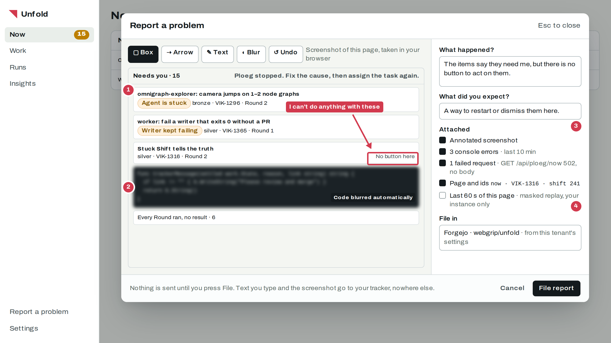
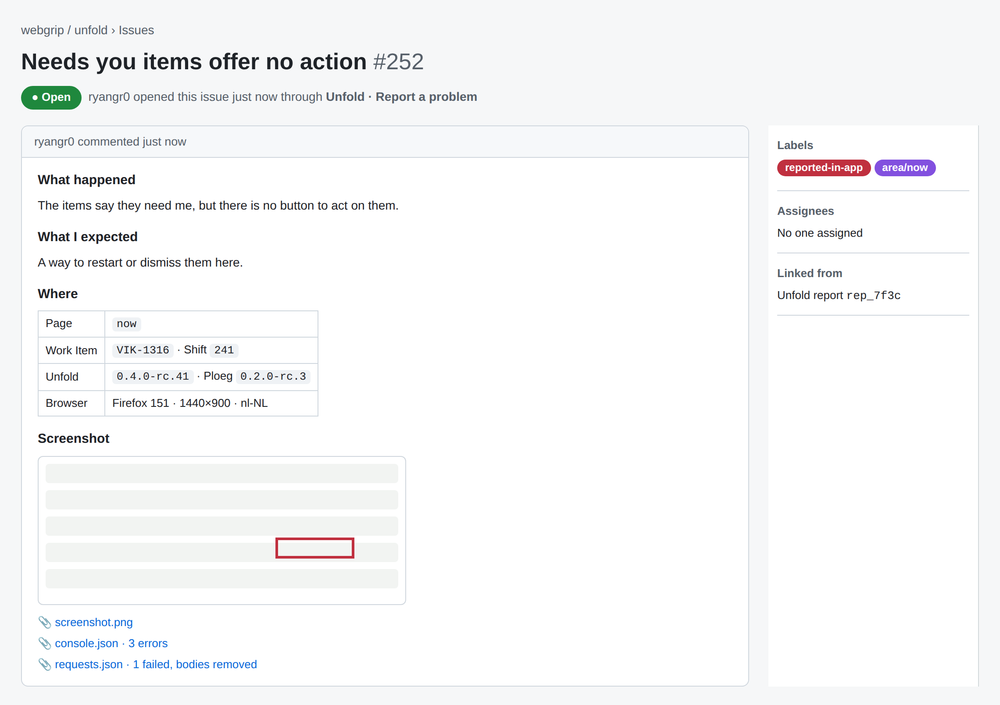
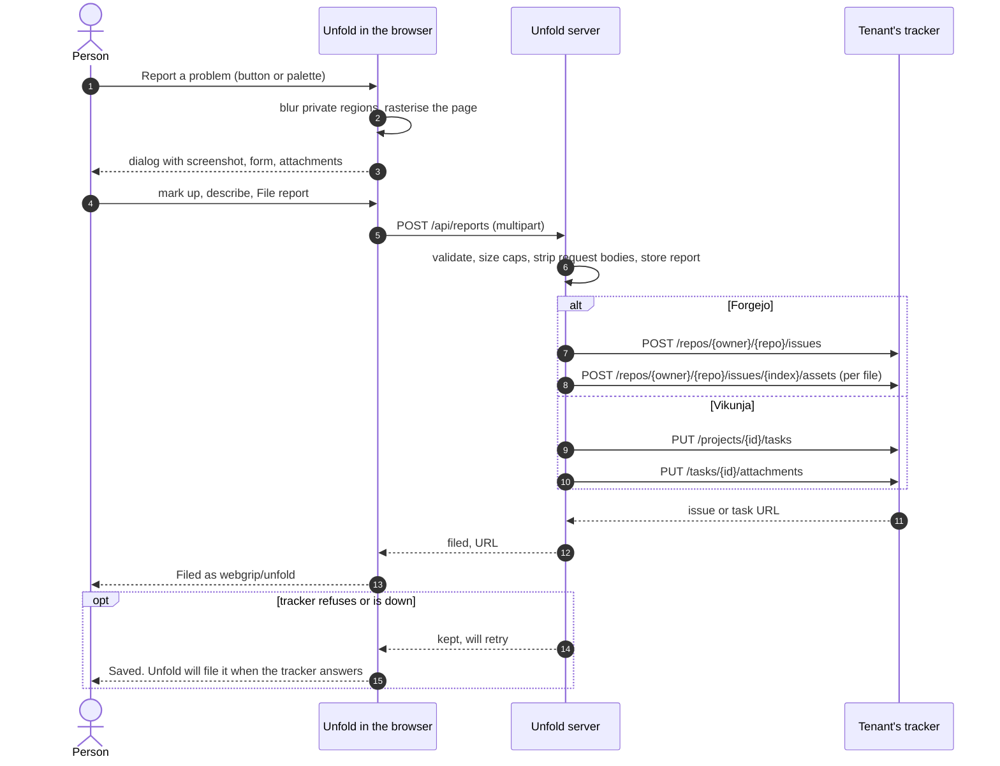

# RFC-0002: Report a problem

> Status: **Accepted** 2026-10-05 · Date: 2026-10-05 · Decision: [ADR-0024](../adr/adr-0024-bug-reports-are-filed-by-unfold-into-the-tenants-own-tracker.md) · Research: [product insight tooling](../research/2026-10-05-product-insight-tooling.md), [bug-reporting evidence](../research/evidence/2026-10-05-product-insight/bug-reporting.md)
>
> **TL;DR.** One button and one palette command. The browser takes a DOM screenshot with code, diffs and pull-request text blurred, lets the person mark it up, and collects recent errors, failed requests and the ids on screen. Unfold's server files it as an issue or task in the tenant's own tracker, with attachments, in two API calls, and shows the link. Nothing is captured in the background, and nothing leaves the install except to the tenant's tracker.

Accepted with its ADR on 2026-10-05. Nothing here is built yet. Every route, setting and file name is proposed.

## What it looks like

1. The screenshot is of the current page, taken in the browser. The person draws boxes, arrows and text, and can blur more.
2. Regions marked private (code, diffs, pull-request text, secrets) are blurred before the person sees the screenshot. They can blur more, never less.
3. Each attachment is listed and can be unticked.
4. The masked 60-second replay appears only on an instance whose tenant has replay switched on, and is unticked by default.

And what lands in the tracker:

## Flow

## Capture in the browser

* **Screenshot.** `@zumer/snapdom` (MIT) rasterises the document to a PNG data URL, which `img-src 'self' data:` already allows. `html-to-image` (MIT) is the fallback if a spike finds snapdom misses Unfold's styles. `getDisplayMedia` is not used, because VS Code webviews do not allow `display-capture`.
* **Private regions.** Components that render code, diffs, pull-request bodies, prompts, logs or secrets set `data-private`. Before rasterising, the clone gets `filter: blur(6px)` on those nodes and a "blurred automatically" tag. A test lists every component that renders such content and fails if one lacks the attribute.
* **Annotation.** An in-house canvas with box, arrow, text, blur and undo, flattened into the PNG. marker.js is not used: its free licence needs a visible link, and its OEM licence (US$ 2,990) covers developer tools.
* **Console.** `console.error`, `window.onerror` and `unhandledrejection` feed a ring buffer of the last 50 entries from the last 10 minutes: message, source file, line and time. Arguments that are objects are summarised by type, not serialised.
* **Requests.** Unfold's own `fetch` wrapper keeps the last 20 failed requests: method, path without query string, status, duration and time. No headers and no bodies.
* **Context.** Route, Work Item, Shift and Run ids on screen, Unfold and Ploeg versions, browser, viewport and locale.
* **Replay.** Only when the tenant's replay setting is on: the last 60 s of the masked recorder from [RFC-0001](rfc-0001-product-events-and-confusion-signals.md), gzip-compressed rrweb JSON.

In the VS Code extension, the palette command "Unfold: Report a problem" opens the same dialog inside the webview. The webview posts the result to the extension host, which calls the server route.

## Route

`POST /api/reports`, multipart: `title`, `happened`, `expected`, `screenshot.png`, `console.json`, `requests.json`, optional `replay.json.gz`. Limits: 8 MB in total, 5 files (Forgejo's default `MAX_FILES`). The server:

1. Checks the session, the tenant's "Report a problem" setting and the CSRF header.
2. Stores the report in a `report` table with status `pending`, so nothing is lost if the tracker fails.
3. Resolves the tenant's report target (below) and files it.
4. Sets status `filed` with the URL, or `failed` with the tracker's answer, and retries `failed` reports with backoff for 24 hours.
5. Records a `report.filed` product event with no text.

The issue body is Markdown in the shape shown above, and gets the label `reported-in-app` when the tracker has it.

## Where reports go

Settings → Insight and feedback names a target per tenant: a provider and a repository or project. It defaults to the tracker source the tenant already uses for work.

| Provider | Create | Attach | Status |
| --- | --- | --- | --- |
| Forgejo | `POST /repos/{owner}/{repo}/issues` (`issueCreateIssue`) | `POST /repos/{owner}/{repo}/issues/{index}/assets` (`issueCreateIssueAttachment`), field `attachment` | first |
| Vikunja | `PUT /projects/{id}/tasks` | `PUT /tasks/{id}/attachments`, field `files` | first |
| GitHub | `POST /repos/{owner}/{repo}/issues` | none in the REST API; the issue links to Unfold's stored copy | later |
| GitLab | `POST /projects/{id}/issues` | `POST /projects/{id}/uploads`, then embed | later |
| ClickUp | `POST /list/{list_id}/task` | `POST /task/{task_id}/attachment` | later |

Unfold's tracker clients in `apps/unfold/src/tasks.ts` read every provider but write only Vikunja comments and assignees. This adds a `createIssue` per provider, with its own tests. The credential is the tenant's existing source credential, which needs issue-write scope. Ploeg's `TrackerProvider` is not changed.

For GitHub, where the API has no attachment upload, Unfold keeps the files and links them from the issue for 90 days.

## Unfold's own reports

Reports about Unfold itself, from the owner's instance, go to `webgrip/unfold` on Forgejo. The stale link in `apps/unfold/CONTRIBUTING.md`, which still points at the renamed `de-vloer` repository, is fixed in the same change. Repository issue templates (`.forgejo/ISSUE_TEMPLATE/bug.md`) mirror the report's sections, so hand-filed issues look the same.

## Privacy

* The person starts every report and sees every attachment before filing. That is a service the user explicitly asked for, which the research record argues sits outside the need for consent. That is an inference, not a regulator statement.
* No background capture. The console and request buffers live in the page's memory only and vanish on reload.
* The `report` table keeps reports for 90 days after filing, then deletes the files and keeps only the URL.

## Tests

* A browser test files a report into a Forgejo fixture and a Vikunja fixture and asserts the issue, the three attachments and the URL shown.
* A screenshot test renders a page with a diff and asserts the diff region is blurred in the PNG.
* A store test shows a `failed` report is retried and becomes `filed` when the fixture recovers.
* The request buffer test proves no header, query string or body is kept.

## Decided questions

Answered by the owner on 2026-10-05, as proposed.

1. Should Unfold suggest a title from the screen and the first sentence? Decided: yes, editable.
2. Should a report on a Work Item also comment on that Work Item's ticket? Decided: no, the report goes to Unfold's feedback target, not the client's ticket.
