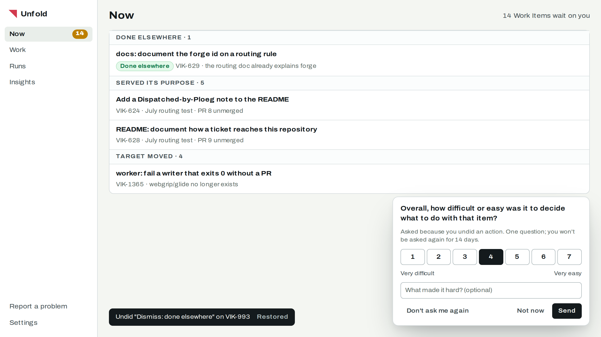
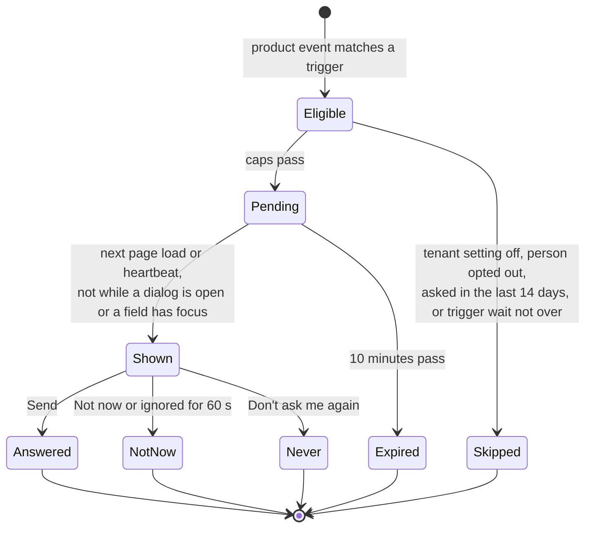

# RFC-0003: One-question surveys

> Status: **Proposed** · Date: 2026-10-05 · Decision: [ADR-0025](../adr/adr-0025-unfold-asks-one-ease-question-on-anomalies-and-a-random-baseline.md) · Research: [product insight tooling](../research/2026-10-05-product-insight-tooling.md), [survey evidence](../research/evidence/2026-10-05-product-insight/micro-surveys.md)
>
> **TL;DR.** When something unusual happens, such as an undo or an item coming back, Unfold asks one question: "Overall, how difficult or easy was it to …?" on a 7-point scale, with an optional line of text. The server decides who is asked, from product events, and enforces the caps. A small random sample asks the same question without any anomaly, so the answers can be compared with a baseline. Results are reported per trigger, never pooled.

Nothing here is built. Every table, route and trigger is proposed.

## What it looks like



The prompt is docked, not modal: the page stays usable behind it. It says why it was asked and when the next question can come.

## Why this question

The Single Ease Question is validated against task completion, time and errors, and is meant to be asked right after a task ([MeasuringU](https://measuringu.com/evolution-of-seq/), [NN/g](https://www.nngroup.com/articles/measuring-perceived-usability/)). Satisfaction questions such as CSAT measure how someone feels about an interaction, which is not what "was it clear what to do" asks. The stem is kept and only the task changes per trigger.

Triggered surveys reach people having a problem, so their answers run low. Google's HaTS samples per user, not per page view, and waits 12 weeks before asking the same person again ([HaTS](https://static.googleusercontent.com/media/research.google.com/en//pubs/archive/43221.pdf)). That is why each trigger is reported on its own and a random baseline runs beside them.

## Triggers

| Trigger | Fires on | Task in the question | Per-trigger wait |
| --- | --- | --- | --- |
| `undo` | `needs_you.undone` | "decide what to do with that item" | 90 days |
| `came_back` | `work_item.back_in_needs_you` for an item this person resolved | "understand why this item came back" | 90 days |
| `link_out_burst` | `ui.link_out_burst` | "find what you needed to decide" | 90 days |
| `rejected_verdict` | `needs_you.command_sent` with `suggested: false` | "decide what to do with that item" | 90 days |
| `first_clear` | the first time this person's Needs you list reaches zero | "clear your Needs you list" | once |
| `review_monthly` | first review screen of a calendar month (K6 in [kpis.md](../reference/kpis.md)) | "review that pull request" | 30 days |
| `baseline` | a random 2 % of people per week, on their next completed Needs-you action | "do what you just did" | 12 weeks |



## Caps, all on the server

* One prompt per person per 14 days, whatever the trigger. "Not now" and an ignored prompt count as shown.
* Each trigger waits the period in the table before asking the same person again.
* "Don't ask me again" stops all prompts for that person until they turn surveys back on in their own settings.
* A person is never asked within 24 hours of signing in for the first time.

Because the caps live on the server, they hold across browsers, devices and VS Code webviews, whose local state does not survive the panel being closed.

## Storage

```sql
CREATE TABLE survey_prompt (
  id INTEGER PRIMARY KEY, tenant_id TEXT NOT NULL, actor TEXT NOT NULL,
  trigger TEXT NOT NULL, trigger_event_id INTEGER, work_item_id INTEGER,
  created_at TEXT NOT NULL, shown_at TEXT,
  outcome TEXT CHECK (outcome IN ('answered','not_now','never','expired','skipped'))
);
CREATE TABLE survey_answer (
  prompt_id INTEGER PRIMARY KEY REFERENCES survey_prompt(id),
  score INTEGER NOT NULL CHECK (score BETWEEN 1 AND 7),
  text TEXT CHECK (length(text) <= 500)
);
```

`actor` is the same pseudonymous id as in [RFC-0001](rfc-0001-product-events-and-confusion-signals.md). Free text can contain personal data. It is kept 12 months, shown only to tenant admins, and never exported. Scores follow the product-event retention.

## Routes

* `GET /api/insight/prompt` returns the pending prompt for this session, or `204`. The client calls it after each route change and with the existing counts heartbeat.
* `POST /api/insight/prompt/{id}` takes `{ outcome, score?, text? }`.

## Reporting

| Figure | How |
| --- | --- |
| Ease per trigger | mean and median score, n, last 90 days; suppressed below n = 5 |
| Gap to baseline | trigger mean minus baseline mean, with both n shown |
| Response rate per trigger | answered ÷ shown |
| Top words | admins read the free text; no automatic analysis of people |

These appear in the Per path table of the Grafana tables in RFC-0001, and in Unfold's own Insights screen for tenants without Grafana. Expect 8–25 % of prompts to be answered, going by vendor benchmarks for B2B in-app surveys.

## Tests

* Caps: a second trigger within 14 days produces a `skipped` prompt; "Don't ask me again" stops the baseline as well.
* A prompt is never returned while the client reports an open dialog or focused field.
* The random baseline selects about 2 % of 10,000 synthetic people in a week, with each person at most once in 12 weeks.
* Answers outside 1–7 and text over 500 characters are refused.

## Open questions

1. Should Dutch-language tenants see the question in Dutch from day one? Proposed: yes, with the stem translated once and reviewed: "Hoe moeilijk of makkelijk was het om …?"
2. Should a very low score (1 or 2) offer "Report a problem" right away? Proposed: yes, as a link in the thank-you line, prefilled with the trigger.
