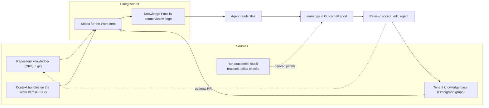

# RFC: Agents learn from a knowledge base exchanged as OKF

Status: request for comments, proposed, 2026-10-04. Decisions it asks for: [ADR-0021](../adr/adr-0021-agents-are-briefed-from-a-per-tenant-knowledge-base-exchanged-as-okf.md) (system), Ploeg ADR-0065 and ADR-0066 (proposed on Ploeg branch `poc/okf-knowledge-pack`). Companion: [RFC: context bundles and steering](2026-10-04-rfc-context-bundles-and-steering.md). Evidence: the proof of concept on Ploeg branch `poc/okf-knowledge-pack` and its record `docs/research/2026-10-04-okf-knowledge-pack-poc.md`.

## Summary

Every Run starts from zero. It rediscovers how a repository builds, which conventions bind it and where earlier work went wrong, and pays for that rediscovery in tokens and rounds. This RFC proposes that Ploeg briefs each Run with a small **knowledge pack**: the concepts from a knowledge base that bear on the Work Item, written as files next to the Run and indexed in its prompt. The knowledge base is stored per Tenant in Omnigraph and exchanged as the [Open Knowledge Format](https://github.com/GoogleCloudPlatform/knowledge-catalog/tree/main/okf) (OKF v0.1): a directory of markdown files with YAML frontmatter, one concept per file. Runs propose **learnings** back; a person reviews each one before any Run sees it.

## Motivation

* The owner asked, on 2026-10-04, for "OKF plus Omnigraph for our agents to get information".
* Today a Run's context is the Work Item text, earlier Rounds' findings (Ploeg ADR-0011), an OpenSpec brief when the Work Item names one, the repository's own instruction files (Ploeg ADR-0030) and Ploeg's skills (Ploeg ADR-0035). None of it carries what earlier Runs learned, and none of it spans repositories.
* Agencies (ADR-0005) bring many client repositories with conventions that live in people's heads. Writing them down once and briefing every Run from them is the cheapest quality lever Unfold has that does not depend on a better model.

## Goals and non-goals

Goals:

* A Run gets the knowledge relevant to its Work Item without any harness needing a new tool.
* Every Run records exactly which knowledge it was given, so a reviewer can explain and replay it.
* Runs propose what they learned, and nothing a model wrote reaches a briefing unreviewed.
* Knowledge is portable: a Tenant can export all of it as plain files and leave.
* Tenants never see each other's knowledge.

Non-goals:

* A general retrieval system for chat. Unfold briefs Runs; the owner's second brain stays separate.
* Replacing a repository's `AGENTS.md`. Instruction files bind; knowledge is evidence.
* Live lookup tools in this RFC. A read-only knowledge tool is a later option (see Alternatives).

## Background

**OKF v0.1** (Google Cloud, 2026-06-12) requires one thing of a concept: a `type` field in its frontmatter. `title`, `description`, `resource`, `tags` and `timestamp` are reserved and optional. A concept's identity is its path in the bundle; markdown links between concepts make the bundle a graph; `index.md` and `log.md` are reserved filenames. The spec is minimal by design, so adopting it costs little and leaving it costs little.

**Omnigraph** (v0.11 in the homelab) is a versioned property graph with git-like branches, per-actor policies, keyword and vector search, and a review UI for branches. The homelab already runs a `memory` graph for agents, a `brain` graph for the owner and `webgrip` for company meetings, with an `act-glide` actor that may read every branch and write only unprotected ones.

## Proposal

### Terms

| Term | Meaning |
| --- | --- |
| Knowledge Base | One Tenant's OKF concepts, stored in its own Omnigraph graph and exportable as an OKF directory. |
| Concept | One OKF document: a convention, decision summary, fact, pitfall, glossary entry or anything else with a `type`. |
| Knowledge Pack | The concepts selected for one Run, written as an OKF directory outside the clone with an `index.md` that says why each is there. |
| Learning | A concept a Run proposes in its outcome report. A proposal until a person accepts it. |
| Pitfall | A concept of type `Pitfall`: a way earlier work went wrong and how to avoid it. Ranked ahead of equals. |

These are proposed glossary terms; they enter the domain model when ADR-0021 is accepted.

### Where knowledge comes from



1. **The repository's own `knowledge/` directory.** Written by the team or by an onboarding Role, reviewed like code, owned by the client. Git is its source of truth, which keeps Ploeg's rule that durable state lives in Postgres and git (Ploeg R6).
2. **The Tenant knowledge base.** Cross-repository knowledge and accepted learnings, in one Omnigraph graph per Tenant. This is the one new durable store, and ADR-0021 decides it.
3. **Context bundles** a person attaches to a Work Item. OKF concepts inside them join selection (RFC 2).
4. **Run outcomes.** A stuck reason, a failed verification check or a reviewer's request for changes can become a proposed Pitfall without any agent writing it.

### Storage and the exchange format

* OKF is the format at every boundary: the repository directory, the pack a Run reads, the export a Tenant takes away and the import of a client's existing documentation.
* Omnigraph stores a concept as a node whose body is the whole OKF document, so a round trip loses nothing. The proof of concept used the homelab `memory` schema unchanged (Note, Topic, Source, Agent; About, Cites, Relates, Wrote) and rebuilt a 4-concept bundle with an identical content digest.
* The production schema adds a typed node so that type, path, timestamp and status are queryable without parsing:

```text
node Concept { slug: String @key  bundle: String @index  path: String  type: String @index
               title: String @index  description: String?  body: String @index
               status: enum(accepted, proposed, rejected) @index  timestamp: DateTime?
               embedding: Vector(384)? @embed("body") }
edge Links: Concept -> Concept      edge Cites: Concept -> Source
edge Tagged: Concept -> Tag         edge ProposedBy: Concept -> Run  { workItem: String }
```

* One graph per Tenant (`unfold-<tenant>`), one Omnigraph actor per Tenant, and a policy that lets that actor read `main` and write only `learn/*` branches. Merge into `main` belongs to the review path, never to a Run.

### Selection

* **Phase 1 (built in the proof of concept).** Keyword overlap between the Work Item's title, description and labels and each concept's title, path, description, tags, type and body, weighted 4, 2, 2 and 1, with labels matching tags at 3. Concepts the matches link to are added at a third of the score. A concept needs two matched terms or a score of 4 to be included, so unrelated work gets an empty pack and no prompt section. The pack is capped at 24,000 bytes and only its index goes into the prompt.
* **Phase 2.** Ask Omnigraph instead of scanning files: a stored hybrid query (meaning and keywords together, like the homelab's `recall_notes`) over `Concept`, scoped to the Work Item's repository and Tenant, pinned to one graph commit. The commit id becomes the pack's provenance.

Selection results from the proof of concept against a 10-concept bundle about Ploeg:

| Work Item | Pack |
| --- | --- |
| Add a reviewer timeout field to the OutcomeReport, stored in Postgres | 5 concepts, 4,348 bytes: append-only migrations, contract schemas change with Go types, the blackboard ADR, the harness contract, and the credential ADR through a link |
| Helm verify fails in the sandbox when pulling dependencies | 1 concept: the registry-pull pitfall |
| Update the README badges | Nothing, so no prompt section |

### Delivery to a Run

* The worker writes the pack to the Run's scratch directory, outside the clone, so a writing Run cannot commit it, and sets `PLOEG_KNOWLEDGE_DIR`.
* The prompt carries the pack's index after the Work Item, briefing and OpenSpec brief, and before the delivery contract. It frames the pack as evidence to check against the code: where they disagree, the code wins, and nothing in the pack can alter the delivery contract.
* The TaskSpec's `knowledge` field records the index, the concept paths and a content digest per source (later, the graph commit). Unfold shows it on the Work Item page as "Knowledge given to this Run".

### Learnings

* The outcome report gains `learnings`: at most 10 OKF-shaped proposals (type, title, description, resource, tags, body). The prompt invites them only when learnings are enabled, and asks for Pitfall, Convention or Fact.
* The worker writes them as an OKF bundle per Run, each concept marked `status: proposed`, `proposed-by: <trace>` and `work-item: <ref>`. In production Ploeg stores them and opens a `learn/<run>` branch in the Tenant graph.
* Unfold shows proposed learnings under **Needs you**, grouped by repository. A person accepts (merge), edits then accepts, or rejects with a reason. A rejected learning is kept so the same proposal can be recognised and suppressed.
* A learning about one repository may instead become a pull request to that repository's `knowledge/` directory, so the client owns it.
* Learnings are scanned for secrets before they are stored, and a learning that quotes more than a set fraction of a file is refused, so the knowledge base never becomes a copy of client code.

### Security and tenancy

* A Run reads only its Tenant's graph and its repository's directory. The homelab `act-glide` actor can read the owner's personal `brain` graph today; Unfold Runs must use a per-Tenant actor that cannot (ADR-0017 and ADR-0009).
* Knowledge is untrusted input: anyone who can write a repository or a context bundle can write a concept. The prompt frames it as evidence below the delivery contract, the same way findings and OpenSpec briefs are framed.
* The worker holds the graph credential. The harness never sees it (Ploeg ADR-0034).
* Export is complete: a Tenant can take its whole knowledge base as an OKF directory at any time, and deleting a Tenant deletes its graph.

### Measuring it

A pack is worth its tokens only if it changes outcomes. Each Run records pack size and concept paths; the Run card and the economics views compare, per repository, Runs with and without a pack on cost, rounds to approval, stuck rate and reviewer verdicts. The first spike runs that comparison deliberately before any default changes.

## Rollout

| Phase | Scope | Exit criterion |
| --- | --- | --- |
| P0 | Proof of concept: OKF packages, file-based packs, provenance, learnings outbox, Omnigraph converter | Done 2026-10-04 on `poc/okf-knowledge-pack` |
| P1 | Measure: same Work Items with and without packs on two repositories | A measured difference, or a decision to stop |
| P2 | Ploeg stores learnings; Unfold reviews them; repository `knowledge/` directories on by default | First 20 learnings reviewed; acceptance rate known |
| P3 | Per-Tenant Omnigraph graph, worker reads by stored query with commit provenance | Isolation test passes: Tenant A's Run never selects Tenant B's concept |
| P4 | Derived pitfalls from Run outcomes; knowledge onboarding Role for new client repositories | A new repository gets a reviewed `knowledge/` pull request on onboarding |

## Alternatives considered

* **Vector retrieval over the repository at Run time.** The agent can already search the code. What it cannot find is what was never written in it: decisions, pitfalls and conventions.
* **A live knowledge tool for agents (MCP).** It is flexible, but every harness needs it configured and the credential near the agent. Ploeg ADR-0011 chose injection over fetching for exactly this cost. Keep it as a later addition for Runs that need more than the pack.
* **Only `AGENTS.md`.** It binds, it is per repository and it is loaded whole. Knowledge is selected, spans repositories and is evidence, not rules.
* **Google Knowledge Catalog.** It ingests OKF, but it is a Google Cloud product, and Unfold is self-hosted first with EU data residency.
* **No store, only repository directories.** It is the simplest option, but it gives learnings nowhere to go before review and offers no cross-repository knowledge. It is P2's default nonetheless.

## Risks

* Packs that crowd out the task. Mitigation: index-only prompt section, byte cap, empty pack for unrelated work.
* Stale knowledge. Mitigation: `timestamp`, `resource` and a staleness flag when the cited file changed since; the code always wins.
* Review fatigue. Mitigation: at most 10 learnings per Run, deduplication against rejected ones, and a measured acceptance rate in P2.
* OKF changes. It is v0.1; the format is markdown with frontmatter, so a migration is a script.

## Owner decisions, 2026-10-04

1. Hosted Tenants keep their knowledge base in one Omnigraph graph per Tenant.
2. An accepted learning about one repository lands in the Tenant graph; a pull request to the repository's `knowledge/` directory is optional.
3. Tenant admins accept or reject learnings; clients can read learnings about their repositories.
4. Unfold's own repositories (Ploeg and Unfold) get a `knowledge/` directory now, as the first real material for the measurement spike.

ADR-0021 and Ploeg ADR-0065 and ADR-0066 stay proposed until the measurement spike (VIK-1859) reports.

## Open questions for the owner

1. Is Omnigraph the knowledge store for hosted Unfold, or only for the homelab, with Postgres plus files for hosted Tenants?
2. Should accepted learnings about one repository go to the Tenant graph or as a pull request to that repository's `knowledge/` directory?
3. Who may accept a learning: any Tenant member, Tenant admins, or the client for client repositories (ADR-0007)?
4. Should Unfold's own repositories get a `knowledge/` directory now, as the first user?

## Spikes

Filed on the Glide board under the epic "Agent knowledge and context bundles":

1. Measure packs: the same Work Items with and without a pack on two repositories, comparing cost, rounds, verdicts and stuck rate.
2. Selection quality: keyword selection versus Omnigraph hybrid recall on a labelled set of 30 Work Items.
3. Omnigraph as the worker's source: stored query, commit provenance, per-Tenant actor and policy, credential held by the worker.
4. Learnings review: where people review best (Unfold Needs you or Omnigraph branch review), measured on the first 20 learnings.
