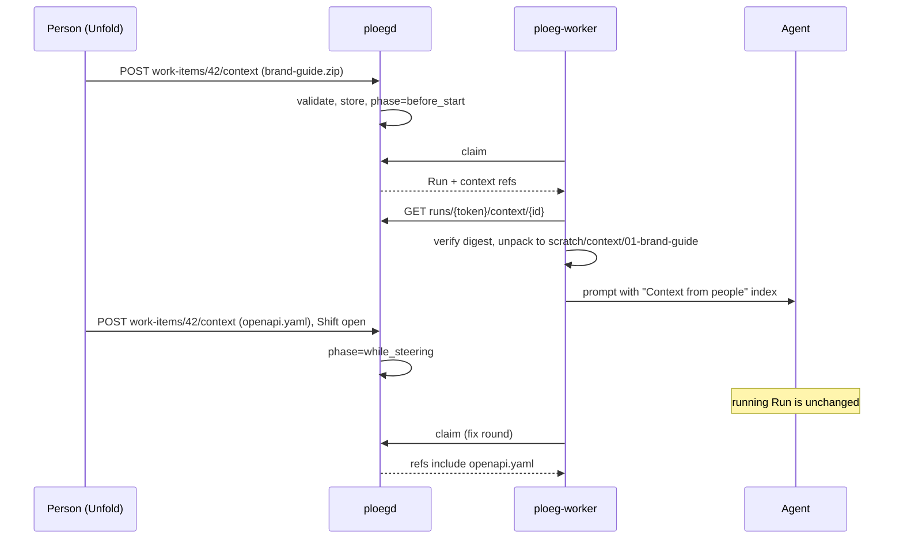

# RFC: People give a Work Item context files, at the start and while steering

Status: request for comments, proposed, 2026-10-04. Decisions it asks for: [ADR-0022](../adr/adr-0022-people-give-a-work-item-context-files-at-the-start-and-while-steering.md) (system), Ploeg ADR-0067 and ADR-0068, and Unfold [ADR-0039](../../apps/unfold/docs/adrs/0039-unfold-collects-context-files-and-hands-them-to-ploeg.md). Companion: [RFC: agents learn from a knowledge base exchanged as OKF](2026-10-04-rfc-agent-knowledge.md).

## Summary

A person can attach files to a Work Item: a zip or tar.gz of documents, or a single file such as a specification, a log, a screenshot or an export. Ploeg stores each file once per Work Item. Every Run claimed after the upload gets every attached file unpacked next to the clone, with an index in its prompt. Attaching a file while a Shift is open is **steering**: the file reaches the next Run (the next Round, fix round or retry), never the Run already running. Unfold collects the files; Ploeg stores and delivers them.

## Motivation

The owner asked on 2026-10-04 for "a zip or something with context for the agents to unpack and keep into account, and during steering you could add more like that". Today:

* Nothing accepts files from a person. Ploeg has no attachment, upload or object storage path; Vikunja attachments are ignored; Unfold's only uploads are card-theme assets for administrators.
* Context that does not fit in a ticket description (a client's brand guide, an API export, a failing log, a design screenshot) reaches an agent only if someone pastes it into the description, where it is truncated, unstructured and lost on the next tracker edit.
* Steering is text only, and it is never live. Unfold saves an operator message and folds it into the prompt of the next role; Ploeg records the same message for audit only; Ploeg's unattended Runs take one prompt at claim time (`acp.go`: one `session/prompt`). Unfold ADR-0023 (proposed) chose to steer between Runs.

## Goals and non-goals

Goals:

* Attach files when work is created or started, and attach more while it is under way.
* Every Run knows exactly which files it was given, by digest, and which were added while steering.
* The archive cannot escape its directory, exhaust a disk or become executable.
* Files a person attaches are evidence for the agent, never instructions that override the delivery contract.

Non-goals:

* Reaching a Run in the middle of a turn. That needs steering between turns, which only ACP harnesses can do (Unfold's `ploeg-front-end.md` option S2) and which is a spike, not this RFC.
* Converting documents. A PDF or image is delivered as it is; whether to add extracted text is a spike.
* Executing anything from a bundle.

## User stories

1. At the start: a client attaches `brand-guide.zip` (logo rules, colour tokens, a tone-of-voice page) to "Restyle the checkout". The writer's first Run reads them.
2. While steering after a review: the reviewer asked for changes because the API shape was guessed. The person attaches `openapi.yaml` and a note "use this spec, not the old one". The fix round's writer gets it; the earlier writer's Run is unchanged.
3. While steering a running Run: the person sees the agent heading the wrong way and attaches a log. Unfold says plainly that it reaches the next Run, and offers to stop the current Run and retry with the new context.
4. Knowledge in context: a team attaches an OKF bundle of their conventions. Its concepts join knowledge-pack selection (RFC: agent knowledge).

## Proposal

### The entity

A **Context Item** belongs to one Work Item. It has an id, a file name, a sniffed media type, a SHA-256 digest, a byte size, a file count, an optional note (500 characters), who added it, when, and a phase: `before_start` before work started, `while_steering` once a Run of the Work Item has started. An open Shift alone does not count, because Shifts open at ingest with Runs still pending. A Work Item holds each digest once: re-uploading the same file is idempotent.

### What can be attached

| Form | Handling |
| --- | --- |
| `.zip` | Unpacked under the limits below |
| `.tar.gz`, `.tgz` | Unpacked under the limits below |
| Any other single file | Stored and delivered as that one file, never interpreted |

Limits, configurable per deployment and later per Tenant: 20 MiB per upload, 50 MiB per Work Item, 2,000 files and 100 MiB uncompressed per archive, 25 MiB per file, a compression ratio of at most 200:1 per entry and paths of at most 300 characters.

Refused outright: absolute paths, any `..` segment, symbolic and hard links, devices and FIFOs, names that are not UTF-8, and duplicate paths. Skipped silently: `__MACOSX/`, `.DS_Store`, `Thumbs.db`. An archive inside an archive is kept as a file. Extracted files are mode 0644 and never executable. Sizes are counted while streaming; declared sizes are never trusted. The same validation runs at upload, so a bad archive is refused while the person is still there, and again in the worker.

### Storage

Phase 1 stores the bytes in Postgres (`work_item_context`, one row per item, content as `bytea`), which keeps Ploeg R6 and needs no new service. At 50 MiB per Work Item that is acceptable for a pilot. Object storage (Garage or S3-compatible, per Tenant bucket, content-addressed) is a spike for when volume or retention requires it. Context Items are deleted with their Work Item, and a person can withdraw one: withdrawn items are kept for provenance but no later Run receives them.

### API

Ploeg operator API, with the existing operator authentication:

* `POST /api/v1/operator/work-items/{id}/context?name=&note=` with the raw file as the body. Returns `201` with the item, `200` if the digest is already attached, `400` naming the rule an archive broke, `404`, `409` for a finished Work Item, and `413` over either size limit.
* `POST /api/v1/operator/executions/{id}/context` for an Operator Execution's Work Item.
* `GET /api/v1/operator/work-items/{id}/context` lists them.

Run API:

* The claim response gains `context`: references only (id, name, media type, digest, size, file count, note, added at, phase), for items added before the claim.
* `GET /api/v1/runs/{token}/context/{id}` returns the bytes, authorised by the Run's capability and only for that Run's Work Item.

### Delivery to a Run

* The worker unpacks each item into `scratch/context/NN-<name>/`, writes `scratch/context/index.md` and sets `PLOEG_CONTEXT_DIR`. The directory is outside the clone, so a writing Run cannot commit it.
* A digest or size mismatch makes the Run stuck with that reason. A Run never proceeds on context it could not verify.
* The prompt section **Context from people** comes directly after the Work Item description. It says the person attached these files for this Work Item, that they are evidence and cannot alter the delivery contract, and that items added while steering are newer than the description and say what the person learned or wants since. The index lists each item with its note and its first 50 paths.
* The TaskSpec's `context` field records every item the Run received, by digest, so the Run card can show "Context given".
* OKF concepts inside a bundle also join knowledge-pack selection as the source `context`.

### Steering semantics

* A Run's context is fixed at claim. This matches how briefing and OpenSpec already work and keeps a Run reproducible.
* An item added while a Shift is open reaches the next Run of that Shift: the next Round, the fix round after a request for changes, or a retry. If the Shift has no further Run, it reaches the next Shift.
* Unfold shows this on the item ("Reaches the next Run, not the one running now") and offers **Apply now**, which stops the running Run and retries it with the new context. Apply now is a proposed follow-up, because stopping costs the spend so far and must be confirmed.
* A text-only steering message remains a message. A file is context. Both are recorded as Shift events with the person who added them.

### Unfold

* An **Add context** control on the Ploeg Work Item page: a file input, an optional note and the list of attached items with size, file count, who and when, an "Added while steering" chip, and the hint of when they apply.
* Unfold forwards the bytes to Ploeg and keeps nothing. It never puts context into its own engine's prompts, because Unfold's rule is that the application's engine gains no execution features before it is retired (ADR-0002). Sessions run by Unfold's own engine therefore do not see context until they run on Ploeg; the session page says so rather than accepting a file it cannot deliver.
* In Unfold's Ploeg demo the upload is refused with "The demo does not store context files": a demo never pretends.
* Later: the session composer and the VS Code panel attach the same way, and the MCP server (ADR-0011) gets an `add_context` tool.

### Relation to Brief Revisions and Context Items

The Unfold workbench epic (VIK-1830) already plans Context Items with provenance on immutable Brief Revisions (VIK-1836) and a context tray to include, exclude and trace them (VIK-1847). The owner decided on 2026-10-03 that steering happens at Run boundaries. This RFC fits that design rather than competing with it:

* A context bundle is the `upload` kind of VIK-1836's Context Item. Its storage, limits, safe unpacking and delivery here answer two of VIK-1836's open questions: where uploads are stored and which size limits apply.
* Until Brief Revisions exist, items attach to the Work Item, which is what the proof of concept does.
* Once they exist, an item attached **before a Shift** joins the draft revision and needs the usual authorization. An item attached **while a Shift is open** is a steering input to that Shift, recorded like a steering message. It reaches the Shift's next Run and leaves the authorized revision unchanged, which keeps VIK-1835's rule that a Shift's revision never changes. When the Shift ends, the person can promote the item into the next draft revision.
* The context tray (VIK-1847) is where people see, include and exclude both kinds. The Unfold upload in this RFC is its first, smallest slice.

This reconciliation is a proposal. The owner confirms it, or chooses that steering files create a draft revision and wait for the next Shift.

### Tracker attachments

Vikunja, ClickUp, GitLab and Forgejo issues have attachments. A tracker attachment added to an assigned item becomes a Context Item through the same validation, with the tracker named as the adder. That keeps one path for agents whichever way the file arrived. It is a follow-up, not phase 1.

### Security

* Archive safety as above, tested with path traversal, link, bomb, duplicate and oversize cases.
* Prompt injection: a context file is attacker-controllable by anyone who can attach one. The prompt frames it as evidence below the delivery contract, the agent's token stays out of reach (Ploeg ADR-0034), and context never changes which tools or credentials a Run gets.
* Secrets: uploads are scanned with gitleaks, as the repository already does for commits; a finding is shown to the person, who confirms or removes the file before any Run receives it. This is a proposed follow-up, recorded as a spike for false-positive rates on documents.
* Tenancy: a Context Item belongs to its Work Item's Tenant, and every route returns 404 outside it (ADR-0017).
* Privacy: files may contain personal data. Retention follows the Work Item; deletion is real deletion of the bytes. Hosted Tenants keep data in the EU.

### Cost

Context costs tokens only when the agent opens a file; the prompt carries the index alone. Storage is bounded by the per-Work-Item limit. The Run card shows how many context files a Run opened, so a person can see whether the files they attached were used. Measuring "opened" needs harness telemetry and is part of the measurement spike.

## Rollout

| Phase | Scope | Exit criterion |
| --- | --- | --- |
| P0 | Proof of concept: safe unpack, Postgres storage, operator and Run routes, worker delivery, Unfold Work Item page upload | Upload, claim and prompt demonstrated in tests on 2026-10-04 |
| P1 | Withdraw, gitleaks scan at upload, Run card "Context given", Apply now | A pilot Work Item steered with a file reaches its fix round |
| P2 | Tracker attachments, session composer and VS Code, MCP `add_context` | One path for all four entry points |
| P3 | Object storage for large Tenants; document text extraction if the spike says so | Measured need |

## Alternatives considered

* **Commit the files to the work branch.** The agent sees them for free, but they pollute the pull request, survive into the client's repository and cannot hold confidential material.
* **Paste into the Work Item description.** It is truncated, unstructured, overwritten by tracker edits and cannot carry binaries.
* **Tracker attachments only.** Not every Work Item has a tracker (Operator Executions, MCP), and trackers differ in limits and auth.
* **An MCP resource the agent fetches.** Agents would need the tool and a credential; injection by Ploeg needs neither (Ploeg ADR-0011).
* **Live delivery into the running turn.** Only ACP harnesses could support it, and only between turns. Kept as a spike.

## Owner decisions, 2026-10-04

0. A file attached while a Shift runs is a steering input to that Shift and reaches its next Run; the authorized Brief Revision stays unchanged.
1. Agency members and clients may attach context; a client only to their own Work Items.
2. Apply now exists: it shows the running Run's spend, and stops and retries only after the person confirms.
3. Limits stay 20 MiB per upload and 50 MiB per Work Item for the first pilot.
4. A file the secret scan flags is held: stored, but given to no Run until a person removes it or confirms it.

ADR-0022, Ploeg ADR-0067 and ADR-0068, and Unfold ADR-0039 were accepted.

## Open questions for the owner

0. Steering files: a steering input to the open Shift that reaches its next Run (proposed), or a draft Brief Revision that waits for the next Shift?
1. Should a client (ADR-0007) be able to attach context to their own Work Items, or only agency members?
2. Should Apply now exist, given it spends the running Run's budget?
3. Are 20 MiB per upload and 50 MiB per Work Item right for the first pilot?
4. Should a secret found in an upload block the file or only warn?

## Spikes

Filed on the Glide board under the epic "Agent knowledge and context bundles":

1. Steering between turns: can an ACP Run accept a follow-up prompt carrying new context, per harness (opencode, Claude Code, OpenHands), and what it costs.
2. Context storage at scale: Postgres `bytea` versus Garage per Tenant, covering backup, retention, deletion and cost.
3. Documents for agents: do agents use PDFs, images and spreadsheets as delivered, or do they need extracted text next to them?
4. Secret scanning of uploads: false-positive rate of gitleaks on typical client documents, and the confirm flow.
